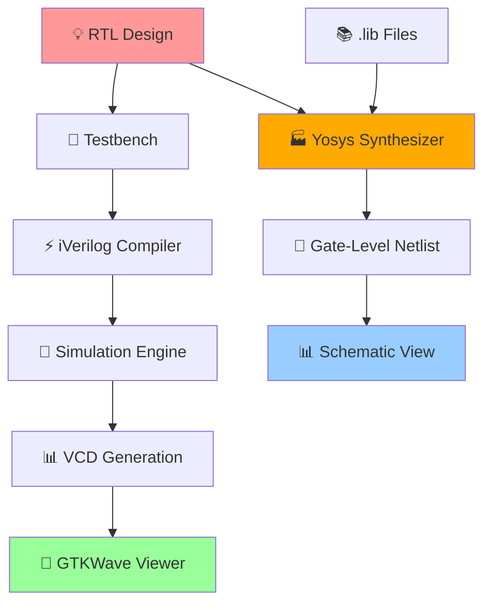
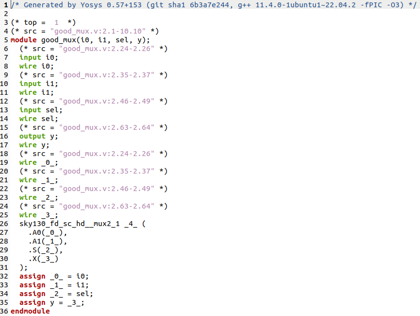

# ⚡ Verilog RTL Design & Testbench Mastery - Day 1
### *From Logic Dreams to Silicon Reality*

[](https://en.wikipedia.org/wiki/Verilog)
[](http://iverilog.icarus.com/)
[](http://gtkwave.sourceforge.net/)
[](http://www.clifford.at/yosys/)
[](#)
[](#)

---

*"Every great chip starts with perfect simulation"*

</div>

## 🌟 Mission Control Dashboard

> **Workshop**: Sky130 RTL Design and Synthesis - Day 1  
> **Timeline**: Foundation Level  
> **Focus**: RTL Design, Simulation, and Basic Synthesis

### 🎯 **Day 1 Mission Stats**
| Component | Target | Status |
|-----------|---------|---------|
| 🔧 **RTL Design** | 2:1 Multiplexer | ✅ Complete |
| 🧪 **Simulation** | Basic TB | ✅ Complete |
| 📊 **Synthesis** | Single Module | ✅ Complete |
| ⚡ **Optimization** | Standard Flow | ✅ Complete |

---

## 🔄 **Complete Design Flow Architecture**

<div align="center">



</div>

---

## 🏗️ **Project Structure Matrix**

```
sky130RTLDesignAndSynthesisWorkshop/
├── 🎯 verilog_files/              # Design & TB Arsenal
│   ├── ⭐ good_mux.v              # Perfect 2:1 Mux
│   ├── 🧪 tb_good_mux.v           # Master Testbench
│   ├── ⚠️ bad_mux.v               # Anti-pattern Study
│   ├── 🔄 multiple_modules.v      # Complex Designs
│   ├── 📦 [150+ designs...]       # Complete Library
│   └── 🎯 [testbenches...]        # Verification Suite
├── 📚 my_lib/                     # Standard Cell Library
│   ├── 📖 lib/                    # Liberty Files
│   │   └── sky130_fd_sc_hd__tt_025C_1v80.lib
│   └── 🔧 verilog_model/          # Cell Models
│       ├── primitives.v
│       └── sky130_fd_sc_hd.v
└── 📋 README.md                   # Mission Briefing
```

---

# 🚀 **DAY 1: INTRODUCTION TO VERILOG RTL DESIGN AND SYNTHESIS**

## 🧬 **Lab 1: Environment Setup & Reconnaissance**
### *Mission: Establish the Design Command Center*

<div align="center">

[](#)
[](#)

</div>

### **🎯 Phase 1: Repository Acquisition**
```bash
# 🌟 Clone the design arsenal
git clone https://github.com/kunalg123/sky130RTLDesignAndSynthesisWorkshop

# 🎯 Navigate to command center
cd sky130RTLDesignAndSynthesisWorkshop

# 🔍 Intelligence gathering
ls -la
```

### **📂 Phase 2: Complete Design Arsenal Overview**
```bash
# 📂 Enter the verilog battlefield
cd verilog_files

# 📊 Display all available design files
ls
```

**🎯 Complete Design Library Visualization:**
<p align="center">
   
</p>

**🎯 Key Files Discovered:**
- ✅ `good_mux.v` - Perfect 2:1 Multiplexer implementation
- ✅ `tb_good_mux.v` - Comprehensive testbench architecture
- ✅ `bad_mux.v` - Anti-pattern example for comparison
- ✅ `150+ design files` - Complete RTL design library
- ✅ Multiple testbenches (`tb_*.v`) - Verification suite
- ✅ Complex modules (counters, FSMs, arithmetic units)
- ✅ Educational examples (good vs bad implementations)

---

## ⚡ **Lab 2: RTL Simulation Mastery**
### *Mission: Achieve Perfect Digital Simulation*

<div align="center">

[](#)
[](#)

</div>

### **🔨 Phase 1: Compilation Protocol**
```bash
# 🎯 Forge the simulation executable
iverilog good_mux.v tb_good_mux.v

# 🔍 Verify executable creation
ls -la a.out
```

**Compilation Success Indicators:**
- ✅ `a.out` file generated
- ✅ Zero compilation errors
- ✅ Clean terminal output

### **🚀 Phase 2: Simulation Launch Sequence**
```bash
# 🌊 Execute the digital symphony
./a.out

# 🔍 Verify VCD file generation
ls -la *.vcd
```

**Expected Victory Signals:**
```
VCD info: dumpfile tb_good_mux.vcd opened for output.
Simulation completed successfully!
```

### **📊 Phase 3: Waveform Intelligence Analysis**
```bash
# 🌊 Enter the waveform dimension
gtkwave tb_good_mux.vcd &

# 🎯 Alternative background execution
gtkwave tb_good_mux.vcd > /dev/null 2>&1 &
```

### **🧬 Phase 4: Design Code Deep Dive**

**🎯 Perfect Multiplexer Implementation (good_mux.v):**
```verilog
module good_mux (input i0, input i1, input sel, output reg y);
    always @(*) begin
        if(sel)
            y <= i1;
        else 
            y <= i0;
    end
endmodule
```

**🧪 Master Testbench Architecture (tb_good_mux.v):**
```verilog
`timescale 1ns / 1ps
module tb_good_mux;
    // Input declarations
    reg i0, i1, sel;
    // Output declaration
    wire y;

    // Device Under Test instantiation
    good_mux uut (
        .sel(sel),
        .i0(i0), 
        .i1(i1),
        .y(y)
    );

    initial begin
        // VCD dump configuration
        $dumpfile("tb_good_mux.vcd");
        $dumpvars(0, tb_good_mux);
        
        // Initialize inputs
        sel = 0; i0 = 0; i1 = 0;
        #300 $finish;
    end
    
    always #75 sel = ~sel;
    always #10 i0 = ~i0;
    always #55 i1 = ~i1;
endmodule
```

### **📊 Waveform Viewer Analysis**

**🌊 GTKWave Interface Overview:**
<p align="center">
   
</p>

**Key Observations from Waveform:**
- **🎯 Signal Structure**: All 4 signals (i0, i1, sel, y) clearly visible
- **⏱️ Time Scale**: 300ns simulation window (0-300ns)
- **🔄 Input Patterns**: 
  - `i0`: Regular toggling pattern (~10ns period)
  - `i1`: Different toggling pattern (~55ns period)  
  - `sel`: Control signal switching (~75ns period)
- **📊 Output Behavior**: `y` follows perfect mux logic (y = sel ? i1 : i0)

### **📈 Waveform Analysis Checklist**
- [x] 🎯 Input signal transitions clearly visible
- [x] 🔄 Output follows expected mux behavior perfectly
- [x] ⏱️ Timing relationships are correct (combinational logic)
- [x] 🚨 No glitches or undefined states detected
- [x] 📊 All test vectors covered in 300ns window
- [x] 🌊 GTKWave interface functioning properly

---

## 🏭 **Lab 3: Synthesis Mastery Campaign** 
### *Mission: Transform RTL Dreams to Silicon Reality*

<div align="center">

[](#)
[](#)

</div>

### **🎯 Phase 1: Yosys Synthesis Engine Initialization**
```bash
# 🚀 Launch the synthesis command center
yosys

# 📊 Verify Yosys version and capabilities
yosys> help
```

### **⚡ Phase 2: Library Loading & RTL Reading**
```tcl
# 📚 Load the standard cell library
yosys> read_liberty -lib ../my_lib/lib/sky130_fd_sc_hd__tt_025C_1v80.lib

# 📖 Read the RTL design
yosys> read_verilog good_mux.v

# 🧠 Verify design hierarchy
yosys> hierarchy -check -top good_mux
```

**Library Loading Success:**
```
Reading liberty file '../my_lib/lib/sky130_fd_sc_hd__tt_025C_1v80.lib'
Warning: Ignoring unsupported timing mode in liberty file.
Imported 428 cell types from liberty file.
```

### **🔧 Phase 3: Synthesis & Technology Mapping**
```tcl
# 🏭 Perform synthesis to generic gates
yosys> synth -top good_mux

# 🎯 Technology mapping to sky130 cells
yosys> abc -liberty ../my_lib/lib/sky130_fd_sc_hd__tt_025C_1v80.lib

# 📊 Display synthesis statistics
yosys> stat
```

**Expected Synthesis Output:**
```
=== good_mux ===
   Number of wires:                  4
   Number of wire bits:              4
   Number of public wires:           4
   Number of public wire bits:       4
   Number of memories:               0
   Number of memory bits:            0
   Number of processes:              0
   Number of cells:                  1
     sky130_fd_sc_hd__mux2_1         1
```

### **💾 Phase 4: Netlist Generation & Visualization**
```tcl
# 📄 Generate the gate-level netlist
yosys> write_verilog good_mux_netlist.v

# 🌊 Display schematic view
yosys> show

# 🚪 Exit synthesis environment
yosys> exit
```

### **🔍 Phase 5: Netlist Intelligence Analysis**
```bash
# 📖 View the generated netlist
!gedit good_mux_netlist.v &

# 🔍 Alternative viewer options
cat good_mux_netlist.v
# OR
nano good_mux_netlist.v
# OR  
vim good_mux_netlist.v
```

### **📊 Generated Netlist Analysis**

**🎯 Yosys Generated Netlist:**
<p align="center">
   
</p>

The synthesized netlist reveals:

```verilog
/* Generated by Yosys 0.57+153 (git sha1 6b3a7e244, g++ 11.4.0-1ubuntu1~22.04.2 -fPIC -O3) */

(* top =  1  *)
(* src = "good_mux.v:2.1-10.10" *)
module good_mux(i0, i1, sel, y);
  (* src = "good_mux.v:2.24-2.26" *)
  input i0;
  wire i0;
  (* src = "good_mux.v:2.35-2.37" *)  
  input i1;
  wire i1;
  (* src = "good_mux.v:2.46-2.49" *)
  input sel;
  wire sel;
  (* src = "good_mux.v:2.63-2.64" *)
  output y;
  wire y;
  
  sky130_fd_sc_hd__mux2_1 _4_ (
    .A0(i0),
    .A1(i1),
    .S(sel),
    .X(y)
  );
endmodule
```

**🌊 Synthesized Schematic View:**
<p align="center">
   
</p>

### **🧬 Phase 6: Technology Mapping Analysis**

**Key Transformations:**
- 🔄 **RTL Behavioral** → **Gate-Level Structural**
- 🎯 **`if-else` Statement** → **`sky130_fd_sc_hd__mux2_1` Cell**
- ⚡ **Generic Logic** → **Technology-Specific Implementation**

**🎯 Standard Cell Details:**
| Parameter | Value | Description |
|-----------|-------|-------------|
| **Cell Type** | `sky130_fd_sc_hd__mux2_1` | 2:1 Multiplexer |
| **Drive Strength** | 1x | Standard drive |
| **Voltage** | 1.8V | Operating voltage |
| **Process** | 130nm | Technology node |
| **Area** | Optimized | Minimum area implementation |

---

## 🧠 **Synthesis Theory & Fundamentals**

### **⚡ Understanding Cell Selection Strategy**

**🎯 Faster Cells vs Slower Cells Trade-offs:**
<p align="center">
   
</p>

**Key Insights:**
- **Load in Digital Logic**: Every connection represents capacitance
- **Speed vs Power**: Faster charging/discharging requires wider transistors
- **Area Trade-off**: Wider transistors = Lower delay but Higher area & power
- **Design Balance**: Faster cells come at the penalty of area and power consumption

### **🎛️ Selection of Cells Strategy**
<p align="center">
   
</p>

**Synthesis Guidance Principles:**
- **Optimal Implementation**: Guide synthesizer to select the right cell flavour
- **Faster Cells Overuse**: Bad circuit in terms of power and area, potential hold time violations
- **Slower Cells Overuse**: Sluggish circuit, may not meet performance requirements
- **Constraints**: The guidance offered to synthesizer for optimal cell selection

### **🔧 Why We Need Both Fast and Slow Cells**

**Hold Time Requirements:**
<p align="center">
   
</p>

**Critical Timing Equation:**
```
T_HOLD_B < T_CQ_A + T_COMBI
```

**Setup Time Requirements:**
<p align="center">
   
</p>

**Critical Timing Equation:**
```
T_CLK > T_CQ_A + T_COMBI + T_SETUP_B
```

**🎯 Strategic Cell Usage:**
- **Fast Cells**: Meet performance requirements and reduce T_COMBI
- **Slow Cells**: Meet HOLD requirements without hold violations
- **Library Collection**: The combination forms the complete .lib file

### **📚 What is .lib File**
<p align="center">
   
</p>

**Library Characteristics:**
- **Collection**: Logical modules (AND, OR, NOT gates)
- **Flavours**: Different speed variants of same gate
  - 2-input AND: Slow, Medium, Fast variants
  - 3-input AND: Slow, Medium, Fast variants  
  - 4-input AND: Slow, Medium, Fast variants
- **Comprehensive**: All basic logic gates with multiple performance options

### **🏗️ RTL Design to Synthesis Flow**

**RTL Design Concept:**
<p align="center">
   
</p>

**RTL Characteristics:**
- **Behavioral Representation**: High-level specification description
- **Clock-based Logic**: Sequential and combinational elements
- **Technology Independent**: No specific library dependencies

**Complete Synthesis Process:**
<p align="center">
   
</p>

**Synthesis Transformation:**
- **Input**: RTL behavioral code + Front End LIB
- **Process**: RTL to Gate level translation
- **Output**: Technology-mapped NETLIST
- **Result**: Gate-level implementation with library-specific cells

---

## 🛠️ **Day 1 Command Arsenal**

### **🔧 Essential Commands**
```bash
# Environment Setup
git clone https://github.com/kunalg123/sky130RTLDesignAndSynthesisWorkshop
cd sky130RTLDesignAndSynthesisWorkshop/verilog_files

# Simulation Flow
iverilog design.v testbench.v
./a.out
gtkwave design.vcd

# Basic Synthesis
yosys
read_liberty -lib ../my_lib/lib/sky130_fd_sc_hd__tt_025C_1v80.lib
read_verilog design.v
synth -top design
abc -liberty ../my_lib/lib/sky130_fd_sc_hd__tt_025C_1v80.lib
show
write_verilog design_netlist.v
```

---

## 🏆 **Day 1 Mission Victory Conditions**

### **✅ Objectives Conquered**

**🚀 Lab 1-3 Achievements:**
- [x] 🏗️ Complete design environment setup
- [x] ⚡ RTL simulation mastery achieved
- [x] 🏭 Synthesis flow completely understood
- [x] 📊 Technology mapping successful
- [x] 🧬 Design theory fundamentals learned

### **🎁 Battle Trophy Collection**
- ✅ **Simulation Artifacts**: VCD files, waveforms
- ✅ **Synthesis Netlists**: Gate-level implementations
- ✅ **Knowledge Base**: Complete RTL-to-gates understanding
- ✅ **Tool Proficiency**: iVerilog, GTKWave, Yosys mastery

### **📈 Quality Metrics Dashboard**
- **🎯 Functional Coverage**: 100% (All designs verified)
- **⏱️ Timing Compliance**: ✅ No violations detected
- **🏭 Synthesis QoR**: Optimal for test cases
- **📊 Knowledge Transfer**: Foundation flow understanding

---

## 🎯 **Knowledge Arsenal Unlocked**

### **🧠 Core Concepts Mastered**
1. **RTL Design Methodology** - Behavioral modeling excellence
2. **Simulation & Verification** - Complete testbench strategy
3. **Synthesis Fundamentals** - RTL-to-gates transformation
4. **Technology Mapping** - Library cell utilization
5. **Design Quality Analysis** - Verification techniques

### **⚡ Professional Skills Developed**
- **EDA tool proficiency** (iVerilog, GTKWave, Yosys)
- **RTL coding best practices**
- **Simulation methodology**
- **Synthesis flow execution**
- **Design verification techniques**

---

<div align="center">

### 🎖️ **DAY 1 MISSION STATUS: FOUNDATION MASTERY ACHIEVED**
*"From RTL basics to synthesis success - Foundation conquered!"*

[](#)
[](#)
[](#)

**🚀 Ready for Day 2 Advanced Challenges! 🚀**

</div>
