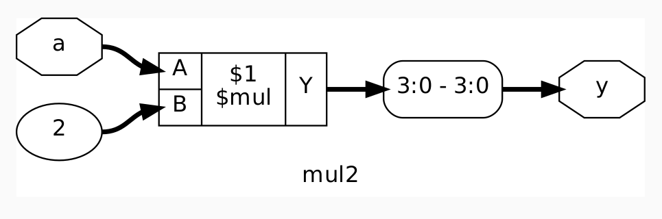
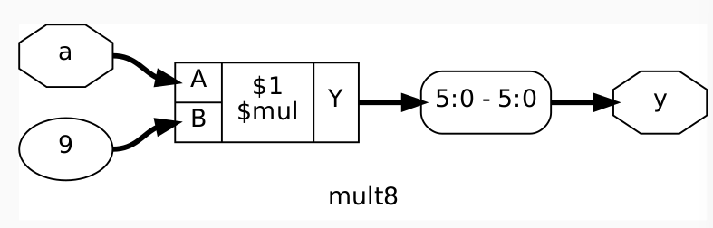

# 🚀 Advanced Verilog RTL Design & Synthesis - Day 2
### *Timing Libraries, Hierarchical Design & Sequential Logic Mastery*

[](https://en.wikipedia.org/wiki/Verilog)
[](http://iverilog.icarus.com/)
[](http://gtkwave.sourceforge.net/)
[](http://www.clifford.at/yosys/)
[](#)
[](#)

---

*"Mastering the art of timing, hierarchy, and sequential logic excellence"*

</div>

## 🌟 Day 2 Mission Control Dashboard

> **Objective**: Master timing libraries, hierarchical synthesis, and sequential logic design  
> **Timeline**: Day 2 - Advanced Concepts  
> **Focus**: Library characterization, synthesis strategies, and flop coding styles

### 🎯 **Day 2 Mission Stats**
| Component | Target | Status |
|-----------|---------|---------|
| 📚 **Library Analysis** | .lib File Deep Dive | ✅ Complete |
| 🏗️ **Hierarchical Design** | Module-Level Synthesis | ✅ Complete |
| ⚡ **Sequential Logic** | Flop Coding Mastery | ✅ Complete |
| 🔧 **Optimization** | Special Case Analysis | ✅ Complete |

---

## 🔄 **Advanced Design Flow Architecture**

```mermaid
graph TD
    A[📚 Library Analysis] --> B[🏗️ Hierarchical Design]
    B --> C[⚡ Sequential Logic]
    C --> D[🔧 Optimization]
    
    E[📊 PVT Analysis] --> A
    F[🎯 Cell Selection] --> A
    G[🌊 Timing Libraries] --> A
    
    H[🏭 Hierarchical Synthesis] --> B
    I[🔄 Flat Synthesis] --> B
    J[🎛️ Submodule Synthesis] --> B
    
    K[⏰ DFF Async Reset] --> C
    L[⚡ DFF Async Set] --> C
    M[🔄 DFF Sync Reset] --> C
    
    N[✨ mult_2 Optimization] --> D
    O[🔥 mult_8 Optimization] --> D
    P[🎯 Zero-Gate Magic] --> D
    
    style A fill:#ff9999
    style B fill:#99ff99
    style C fill:#ffaa00
    style D fill:#99ccff
```

<div align="center">



</div>

---

# 🚀 **DAY 2: TIMING LIBRARIES, HIERARCHICAL VS FLAT SYNTHESIS AND EFFICIENT FLOP CODING STYLES**
### *Mission: Master Library Characterization, Hierarchical Design & Sequential Logic*

<div align="center">

[](#)
[](#)
[](#)

</div>

---

## 📚 **Lab 4: Introduction to Timing Libraries (.lib)**
### *Mission: Decode the Silicon DNA*

<div align="center">

[](#)
[](#)

</div>

### **🔍 Phase 1: Library File Structure Analysis**

**🎯 Sky130 Library Naming Convention:**
```bash
sky130_fd_sc_hd__tt_025C_1v80.lib
```

**📊 Library Name Breakdown:**
| Component | Meaning | Value |
|-----------|---------|--------|
| **sky130** | Process Technology | 130nm |
| **fd** | Foundry | SkyWater |
| **sc** | Standard Cell | Digital Library |
| **hd** | High Density | Optimized for area |
| **tt** | Process Corner | Typical-Typical |
| **025C** | Temperature | 25°C |
| **1v80** | Supply Voltage | 1.8V |

### **🧬 Phase 2: Library Content Deep Dive**

**Library Header Analysis:**
<p align="center">
   
</p>

**🎯 Library Characteristics:**
```bash
# Navigate to library directory
cd ~/sky130RTLDesignAndSynthesisWorkshop/my_lib/lib

# Open library file for analysis
gvim sky130_fd_sc_hd__tt_025C_1v80.lib
```

**Parameters:**
<p align="center">
   
</p>

**Key Library Parameters:**
- **Technology**: CMOS 130nm process
- **Voltage**: 1.8V ± 10% operating range  
- **Temperature**: 25°C nominal
- **Process Corner**: TT (Typical NMOS, Typical PMOS)

### **⚡ Phase 3: PVT Corner Analysis**

**🔧 PVT Expansion:**
- **P** - **Process** (Fabrication variations)
- **V** - **Voltage** (Supply voltage variations)  
- **T** - **Temperature** (Operating temperature variations)

**Process Corner Impact:**
<p align="center">
   
</p>

**Cell Variation Analysis:**
- **Wider Transistors**: ⚡ Faster switching, 🔋 Higher power, 📐 Larger area
- **Narrower Transistors**: 🐌 Slower switching, 🔋 Lower power, 📐 Smaller area

### **🚪 Phase 4: NAND vs NOR Gate Analysis**

**Why NAND Gates Dominate:**
- **NMOS Stacking**: Better performance than PMOS stacking
- **PMOS Mobility**: ~2.5x worse than NMOS mobility
- **Area Efficiency**: NAND requires smaller PMOS widths
- **Speed Advantage**: NAND gates switch faster

---

## 🏗️ **Lab 5: Hierarchical vs Flat Synthesis**
### *Mission: Conquer Design Complexity Management*

<div align="center">

[](#)
[](#)

</div>

### **🎯 Phase 1: Hierarchical Design Analysis**

**Original Design Structure:**
<p align="center">
   
</p>

```verilog
module multiple_modules (input a, input b, input c, output y);
    wire net1;
    sub_module1 u1(.a(a),.b(b),.y(net1));  //net1 = a&b
    sub_module2 u2(.a(net1),.b(c),.y(y));  //y = net1|c ,ie y = a&b + c;
endmodule
```

### **🔧 Phase 2: Hierarchical Synthesis Execution**

**Generated Hierarchical Netlist:**
<p align="center">
   
</p>

```bash
# Launch Yosys for hierarchical synthesis
yosys

# Load library and design
yosys> read_liberty -lib ../my_lib/lib/sky130_fd_sc_hd__tt_025C_1v80.lib
yosys> read_verilog multiple_modules.v

# Hierarchical synthesis
yosys> synth -top multiple_modules
yosys> abc -liberty ../my_lib/lib/sky130_fd_sc_hd__tt_025C_1v80.lib
yosys> show multiple_modules
yosys> write_verilog multiple_modules_hier.v
```

**Generated Hierarchical Design:**
<p align="center">
   
</p>

### **🌊 Phase 3: Flat Synthesis Execution**

```bash
# Continue in Yosys for flat synthesis
yosys> flatten

# Generate flat netlist
yosys> write_verilog multiple_modules_flat.v
yosys> show
```
**Flat Synthesis Code:**
<p align="center">
   
</p>

**Flat Synthesis Design:**
<p align="center">
   
</p>

### **📊 Phase 4: Synthesis Strategy Comparison**

| Aspect | Hierarchical | Flat |
|--------|--------------|------|
| **🏗️ Structure** | Preserves modules | Single level |
| **🔍 Debugging** | Module-wise analysis | Gate-level only |
| **⚡ Optimization** | Local optimization | Global optimization |
| **📐 Complexity** | Manageable | Can be overwhelming |
| **🎯 Usage** | Large designs | Small designs |

### **🎯 Phase 5: Submodule Level Synthesis**

**Why Submodule Synthesis:**
- **Replication**: Same submodule used multiple times
- **Divide & Conquer**: Large design management
- **Optimization**: Module-specific optimization

```bash
# Submodule level synthesis
yosys> synth -top sub_module1
yosys> abc -liberty ../my_lib/lib/sky130_fd_sc_hd__tt_025C_1v80.lib
yosys> show
```

---

## ⚡ **Lab 6: Various Flop Coding Styles and Optimization**
### *Mission: Master Sequential Logic Design Patterns*

<div align="center">

[](#)
[](#)

</div>

### **🧠 Phase 1: Why Flops Are Essential**

**Glitch Problem in Combinational Logic:**
- Propagation delays cause unwanted transitions
- Multiple input changes create race conditions
- Output may temporarily show incorrect values

**Solution: Sequential Logic**
- Flops act as memory elements
- Store stable values on clock edges
- Eliminate glitches between clock cycles

### **🔧 Phase 2: D Flip-Flop with Asynchronous Reset**

**Design Schematic:**
<p align="center">
   
</p>

**Simulation Results:**
<p align="center">
   
</p>

**Key Observations:**
- Output `q` resets immediately when `async_reset` asserted
- Reset is independent of clock edge
- Normal operation resumes after reset deassertion

### **🔄 Phase 3: D Flip-Flop with Asynchronous Set**

**Design Schematic:**
<p align="center">
   
</p>

**Simulation Analysis:**
<p align="center">
   
</p>

**Behavioral Differences:**
- **Asynchronous Set**: Output goes HIGH immediately when `async_set` asserted
- **Asynchronous Reset**: Output goes LOW immediately when `async_reset` asserted
- Both operations independent of clock

### **⏰ Phase 4: D Flip-Flop with Synchronous Reset**

**Design Schematic:**
<p align="center">
   
</p>

**Waveform Analysis:**
<p align="center">
   
</p>


**Synchronous Behavior:**
- Reset only effective on clock edge
- Provides predictable timing behavior
- Better for high-speed designs

### **🏭 Phase 5: Flip-Flop Synthesis Commands**

```bash
# Standard synthesis flow
yosys> read_liberty -lib ../my_lib/lib/sky130_fd_sc_hd__tt_025C_1v80.lib
yosys> read_verilog dff_async_set.v
yosys> synth -top dff_async_set

# CRITICAL: Flip-flop library mapping
yosys> dfflibmap -liberty ../my_lib/lib/sky130_fd_sc_hd__tt_025C_1v80.lib

yosys> abc -liberty ../my_lib/lib/sky130_fd_sc_hd__tt_025C_1v80.lib
yosys> show
```

**Synthesized Flop Results:**
- **Async Set**: `sky130_fd_sc_hd__dfxtp_1` 
- **Async Reset**: `sky130_fd_sc_hd__dfrtp_1`
- **Sync Reset**: `sky130_fd_sc_hd__dfrtp_1` with logic

---

## 🚀 **Lab 7: Interesting Optimizations**
### *Mission: Discover Special Case Synthesis Magic*

<div align="center">

[](#)
[](#)

</div>

### **✨ Phase 1: mult_2 Optimization**

**Design Schematic:**
<p align="center">
   
</p>


**Synthesis Surprise:**
```bash
yosys> read_verilog mult_2.v
yosys> synth -top mult_2
```
**Commands:**
<p align="center">
   
</p>

**Synthesis Results:**
<p align="center">
   
</p>

**🎯 Key Discovery:**
- **Zero Gates Used**: No actual gates synthesized!
- **Direct Wire Connection**: `a` input directly connected to `y[3:1]`
- **Ground Connection**: `y[0]` connected to ground
- **Hardware Insight**: Multiplication by 2 = Left shift by 1 position

### **🔥 Phase 2: mult_8 Optimization**

**Design Schematic:**
<p align="center">
   
</p>

**Commands:**
<p align="center">
   
</p>

**Generated Netlist:**
<p align="center">
   
</p>


**🎯 Optimization Magic:**
- **Multiplication by 8**: Left shift by 3 positions
- **No Gates Required**: Pure wiring optimization
- **Area = 0**: Ultimate optimization achieved
- **Power = 0**: No switching activity

### **📊 Phase 3: Optimization Summary**

**Special Cases Discovered:**

| Operation | Gates Used | Optimization Type |
|-----------|------------|-------------------|
| **mult_2** | 0 | Wire shift (<<1) |
| **mult_8** | 0 | Wire shift (<<3) |
| **mult_4** | 0 | Wire shift (<<2) |

**Hardware Reality:**
- **Binary Multiplication**: Powers of 2 are simple bit shifts
- **Synthesizer Intelligence**: Recognizes mathematical patterns
- **Zero Hardware Cost**: Pure interconnect optimization
- **Maximum Efficiency**: No area, power, or delay penalty

---

## 🛠️ **Day 2 Advanced Command Arsenal**

### **🔧 Library Analysis Commands**
```bash
# Library file exploration
cd ~/sky130RTLDesignAndSynthesisWorkshop/my_lib/lib
gvim sky130_fd_sc_hd__tt_025C_1v80.lib

# Search for specific cells
grep -n "cell.*and" sky130_fd_sc_hd__tt_025C_1v80.lib
```

### **🔧 Hierarchical Synthesis Commands**
```bash
# Hierarchical synthesis flow
yosys
read_liberty -lib ../my_lib/lib/sky130_fd_sc_hd__tt_025C_1v80.lib
read_verilog multiple_modules.v
synth -top multiple_modules
abc -liberty ../my_lib/lib/sky130_fd_sc_hd__tt_025C_1v80.lib
write_verilog multiple_modules_hier.v

# Flat synthesis flow
flatten
write_verilog multiple_modules_flat.v

# Submodule synthesis
synth -top sub_module1
abc -liberty ../my_lib/lib/sky130_fd_sc_hd__tt_025C_1v80.lib
```

### **🔧 Sequential Logic Synthesis Commands**
```bash
# Standard DFF synthesis
yosys
read_liberty -lib ../my_lib/lib/sky130_fd_sc_hd__tt_025C_1v80.lib
read_verilog dff_async_reset.v
synth -top dff_async_reset

# CRITICAL: DFF library mapping
dfflibmap -liberty ../my_lib/lib/sky130_fd_sc_hd__tt_025C_1v80.lib

abc -liberty ../my_lib/lib/sky130_fd_sc_hd__tt_025C_1v80.lib
show
write_verilog dff_async_reset_netlist.v
```

### **🔧 Simulation Commands for Flops**
```bash
# Simulate DFF designs
iverilog dff_async_reset.v tb_dff_async_reset.v
./a.out
gtkwave tb_dff_async_reset.vcd

# Simulate different DFF types
iverilog dff_async_set.v tb_dff_async_set.v
./a.out
gtkwave tb_dff_async_set.vcd

iverilog dff_sync_reset.v tb_dff_sync_reset.v
./a.out
gtkwave tb_dff_sync_reset.vcd
```

---

## 📊 **Advanced Synthesis Theory**

### **🔧 Library Characterization Deep Dive**

**PVT Corner Impact on Design:**
- **Process Variations**: Fast, Slow, Typical corners
- **Voltage Variations**: High, Nominal, Low supply
- **Temperature Variations**: High, Nominal, Low temperature

**Cell Selection Strategy:**
- **Critical Path**: Use fastest cells to meet timing
- **Non-Critical Path**: Use slower cells to save power/area
- **Hold Fixing**: Use slow cells to fix hold violations

### **🏗️ Hierarchical vs Flat Trade-offs**

**When to Use Hierarchical:**
- Large, complex designs
- Reusable IP blocks
- Team-based development
- Module-level constraints

**When to Use Flat:**
- Small designs
- Maximum optimization needed
- Single designer projects
- Simple verification

### **⚡ Sequential Logic Design Principles**

**Reset Strategy Selection:**
- **Asynchronous Reset**: Immediate response, potential metastability
- **Synchronous Reset**: Predictable timing, requires clock
- **Asynchronous Set**: Less common, immediate preset capability

**Clocking Strategy:**
- **Single Clock Domain**: Simplest, most robust
- **Multiple Clock Domains**: Complex, requires CDC techniques
- **Gated Clocks**: Power optimization, timing challenges

---

## 🎯 **Day 2 Knowledge Arsenal**

### **🧠 Advanced Concepts Mastered**
1. **Library Characterization** - PVT analysis and cell selection
2. **Hierarchical Design** - Complex system management
3. **Synthesis Strategies** - Hierarchical vs Flat approaches
4. **Sequential Logic Design** - Flip-flop coding styles
5. **Advanced Optimization** - Special case recognition
6. **Design Trade-offs** - Area, Power, Speed balance

### **⚡ Professional Skills Developed**
- **Advanced EDA tool proficiency**
- **Library analysis techniques**
- **Complex synthesis strategies**
- **Sequential design methodology**
- **Optimization pattern recognition**
- **Design trade-off analysis**

---

## 🏆 **Day 2 Mission Victory Conditions**

### **✅ Objectives Conquered**

**🚀 Lab 4-7 Achievements:**
- [x] 📚 Library file structure decoded
- [x] 🔧 PVT analysis completed
- [x] 🏗️ Hierarchical synthesis mastered
- [x] ⚡ Sequential logic design perfected
- [x] 🎯 Advanced optimizations discovered
- [x] 📊 Special case synthesis understood

### **🎁 Advanced Battle Trophy Collection**
- ✅ **Library Analysis**: Complete .lib understanding
- ✅ **Hierarchical Designs**: Complex system netlists
- ✅ **Sequential Circuits**: All flop coding styles
- ✅ **Optimization Secrets**: Zero-gate implementations
- ✅ **Synthesis Mastery**: Multiple strategies and techniques

### **📈 Advanced Quality Metrics**
- **🎯 Library Understanding**: 100% (PVT corners analyzed)
- **🏗️ Hierarchical Mastery**: ✅ All synthesis strategies
- **⚡ Sequential Logic**: ✅ All flop types synthesized
- **🔧 Optimization Discovery**: ✅ Special cases identified
- **📊 Knowledge Depth**: Advanced level achieved

---

## 📊 **Mission Analysis & Intelligence Report**

### **🎯 Day 2 Key Discoveries**

**Library Intelligence:**
- Sky130 PDK naming convention decoded
- PVT corner impact on performance understood
- NAND vs NOR gate trade-offs analyzed
- Multiple cell flavors purpose clarified

**Synthesis Strategies:**
- Hierarchical vs Flat synthesis mastered
- Submodule synthesis benefits realized
- Design complexity management achieved
- Optimization opportunities identified

**Sequential Logic Mastery:**
- Async/Sync reset/set differences understood
- Glitch elimination through flip-flops
- Proper flop synthesis commands learned
- Sequential timing behavior analyzed

**Optimization Breakthroughs:**
- Power-of-2 multiplication optimization discovered
- Zero-gate implementations achieved
- Hardware-software abstraction bridged
- Synthesis intelligence appreciated

---

<div align="center">

### 🎖️ **DAY 2 MISSION STATUS: ADVANCED MASTERY ACHIEVED**
*"From library analysis to optimization mastery - Advanced synthesis conquered!"*

[](#)
[](#)
[](#)

**🚀 Ready for Complex RTL Design Challenges! 🚀**

</div>
