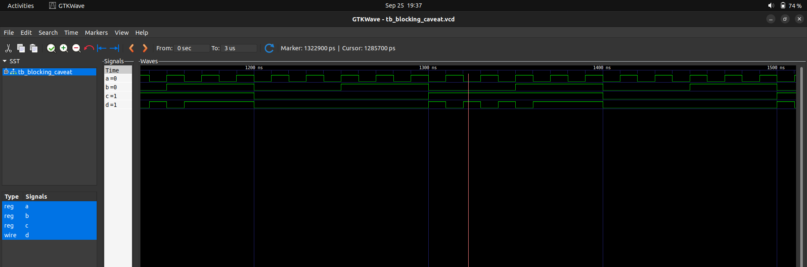

# 🚀 Advanced Verilog RTL Design & Synthesis - Day 4
### *Gate-Level Simulation, Blocking vs Non-blocking & Synthesis-Simulation Mismatch Mastery*

[](https://en.wikipedia.org/wiki/Verilog)
[](http://iverilog.icarus.com/)
[](http://gtkwave.sourceforge.net/)
[](http://www.clifford.at/yosys/)
[](#)
[](#)

---

*"Bridging the gap between synthesis and simulation: From RTL to Gate-Level verification"*

</div>

## 🌟 Day 4 Mission Control Dashboard

> **Objective**: Master Gate-Level Simulation and understand synthesis-simulation mismatches  
> **Timeline**: Day 4 - Advanced Verification Concepts  
> **Focus**: GLS workflow, blocking/non-blocking assignments, and synthesis mismatch debugging

### 🎯 **Day 4 Mission Stats**
| Component | Target | Status |
|-----------|---------|---------|
| 🔬 **Gate-Level Simulation** | GLS Flow & Verification | ✅ Complete |
| ⚠️ **Synthesis-Simulation Mismatch** | Root Cause Analysis | ✅ Complete |
| 🔄 **Blocking vs Non-blocking** | Assignment Strategies | ✅ Complete |
| 🐛 **Debugging Techniques** | Mismatch Resolution | ✅ Complete |

---

## 🔄 **Advanced GLS & Verification Flow Architecture**

```mermaid
graph TD
    A[🎯 RTL Design] --> B[🔧 Synthesis]
    B --> C[📋 Netlist Generation]
    C --> D[🔬 Gate-Level Simulation]
    D --> E[🔍 Verification]
    
    F[⚠️ Synthesis-Sim Mismatch] --> G[🔍 Root Cause Analysis]
    G --> H[🧩 Missing Sensitivity List]
    G --> I[🔄 Blocking vs Non-blocking]
    G --> J[📝 Non-standard Verilog]
    
    H --> K[🛠️ Fix & Re-verify]
    I --> K
    J --> K
    K --> D
    
    L[🧪 Test Bench] --> D
    M[📚 Gate-Level Models] --> D
    N[⏰ Timing Models] --> D
    
    style A fill:#ff9999
    style D fill:#99ff99
    style F fill:#ffaa00
    style E fill:#99ccff
```

<div align="center">



</div>

---

# 🚀 **DAY 4: GATE-LEVEL SIMULATION & SYNTHESIS-SIMULATION MISMATCH**
### *Mission: Master Post-Synthesis Verification and Debug Mismatches*

<div align="center">

[](#)
[](#)
[](#)

</div>

---

## 🔬 **Lab 13: Introduction to Gate-Level Simulation (GLS)**
### *Mission: Understanding Post-Synthesis Verification*

<div align="center">

[](#)
[](#)

</div>

### **🎯 Phase 1: What is Gate-Level Simulation?**

**GLS Definition & Purpose:**
Gate-Level Simulation (GLS) is a critical verification step in the digital design flow that involves:

- **Running test bench with Netlist**: Using the synthesized netlist as Design Under Test (DUT)
- **Logical Equivalence**: Netlist is logically equivalent to original RTL code  
- **Same Test Bench**: Reuse RTL testbench for gate-level verification
- **Post-Synthesis Verification**: Validate design after synthesis transformations

**Why GLS is Essential:**
1. **Logical Correctness Verification**: Ensure synthesis didn't introduce errors
2. **Timing Verification**: Validate design meets timing requirements
3. **Technology Mapping Validation**: Confirm proper cell mapping
4. **Power Analysis**: Evaluate power consumption with real gates

### **🔧 Phase 2: GLS using iVerilog Workflow**

**Complete GLS Flow:**

```mermaid
graph LR
    A[📋 Netlist] --> D[🔬 iVerilog Simulator]
    B[📚 Gate Models] --> D
    C[🧪 Test Bench] --> D
    D --> E[📊 VCD Output]
    E --> F[📈 GTKWave Viewer]
    
    style D fill:#99ff99
    style F fill:#99ccff
```



**Required Inputs for GLS:**
1. **Design Netlist**: Synthesized gate-level representation
2. **Gate-Level Models**: Standard cell library models
3. **Test Bench**: Same verification environment as RTL
4. **Timing Information**: For timing-aware simulation (optional)

**GLS Command Flow:**
```bash
# Gate-Level Simulation with iVerilog
iverilog -DFUNCTIONAL -DUNIT_DELAY=#1 \
    verilog_model/primitives.v \
    verilog_model/sky130_fd_sc_hd.v \
    netlist.v testbench.v

# Execute simulation
./a.out

# View waveforms
gtkwave testbench.vcd
```

### **📊 Phase 3: GLS vs RTL Simulation Comparison**

**Key Differences:**

| Aspect | RTL Simulation | Gate-Level Simulation |
|--------|---------------|----------------------|
| **Design Representation** | Behavioral/Structural RTL | Gate-level netlist |
| **Simulation Speed** | Fast | Slower (more gates) |
| **Timing Accuracy** | Functional only | Can include real delays |
| **Debug Capability** | Easy signal tracing | Complex gate-level debug |
| **Verification Scope** | Functional correctness | Logic + Timing + Power |

---

## ⚠️ **Lab 14: Synthesis-Simulation Mismatch**
### *Mission: Identify and Debug Design Mismatches*

<div align="center">

[](#)
[](#)

</div>

### **🎯 Phase 1: Understanding Synthesis-Simulation Mismatch**

**What is Synthesis-Simulation Mismatch?**
A condition where RTL simulation results differ from gate-level simulation or actual hardware behavior after synthesis.

**Root Causes of Mismatch:**
1. **Missing Sensitivity List**: Incomplete always block sensitivity
2. **Blocking vs Non-blocking Assignments**: Incorrect assignment usage  
3. **Non-standard Verilog Coding**: Synthesis tool interpretation issues

### **🧩 Phase 2: Missing Sensitivity List Issues**

**The Problem:**
```verilog
// Incomplete sensitivity list - WRONG
always @(sel) begin
    case(sel)
        1'b0: y = i0;
        1'b1: y = i1;
    endcase
end
```

**RTL Simulation**: Only triggers on `sel` changes, ignores `i0` and `i1` changes
**Synthesis**: Creates combinational logic sensitive to all inputs
**Result**: Mismatch between simulation and hardware

**The Solution:**
```verilog
// Complete sensitivity list - CORRECT
always @(*) begin    // or @(sel, i0, i1)
    case(sel)
        1'b0: y = i0;
        1'b1: y = i1;
    endcase
end
```

### **🔄 Phase 3: Blocking vs Non-blocking Assignments**

**Assignment Types:**

**Blocking Assignment (=):**
- **Execution**: Sequential, immediate assignment
- **Usage**: Combinational logic modeling
- **Behavior**: Each statement executes in order

**Non-blocking Assignment (<=):**
- **Execution**: Concurrent, scheduled assignment  
- **Usage**: Sequential logic modeling
- **Behavior**: All assignments scheduled simultaneously

**Example of Incorrect Usage:**
```verilog
// WRONG: Blocking in sequential logic
always @(posedge clk) begin
    q1 = d;      // Blocking assignment
    q2 = q1;     // Creates unintended combo path
end
```

**Correct Usage:**
```verilog
// CORRECT: Non-blocking in sequential logic
always @(posedge clk) begin
    q1 <= d;     // Non-blocking assignment
    q2 <= q1;    // Proper register chain
end
```

---

## 🔬 **Lab 15: GLS Synthesis-Simulation Mismatch Examples**
### *Mission: Hands-on Mismatch Detection and Resolution*

<div align="center">

[](#)
[](#)

</div>

### **🎯 Phase 1: Ternary Operator MUX Analysis**

**ternary_operator_mux Example:**

**RTL Simulation Results:**
<p align="center">
   
</p>

**Gate-Level Simulation Results:**  
<p align="center">
   
</p>

**Synthesis Implementation:**
<p align="center">
   
</p>

**Analysis:**
- **RTL Behavior**: Proper ternary operator functionality
- **Synthesis Result**: Correctly mapped to MUX2_1 cell
- **Conclusion**: No mismatch - correct implementation

### **⚠️ Phase 2: Bad MUX - Missing Sensitivity List**

**bad_mux Verilog Code Analysis:**
```verilog
module bad_mux (input i0, i1, sel, output reg y);
    always @(sel) begin         // MISSING i0, i1 in sensitivity list
        case(sel)
            1'b0: y = i0;
            1'b1: y = i1;
        endcase
    end
endmodule
```

**RTL Simulation Behavior:**
<p align="center">
   
</p>

**Critical Observation:**
- Output `y` only changes when `sel` toggles
- Changes in `i0` and `i1` are **IGNORED** in RTL simulation
- This creates a **LATCH-like behavior** in simulation

**Gate-Level Simulation:**
<p align="center">
   
</p>

**Synthesis Implementation:**
<p align="center">
   
</p>

**Mismatch Analysis:**
- **RTL Simulation**: Acts like a latch (ignores input changes)
- **Gate-Level/Hardware**: Behaves as proper MUX (responds to all inputs)
- **Root Cause**: Missing sensitivity list entries
- **Impact**: Functional verification failure

### **🛠️ Phase 3: Blocking Caveat Example**

**blocking_caveat Verilog Code:**
```verilog
module blocking_caveat (input a, b, c, output reg d);
    reg x;
    always @(*) begin
        x = a & b;    // Blocking assignment
        d = c | x;    // Uses updated x immediately  
    end
endmodule
```

**RTL Simulation Results:**
<p align="center">
   
</p>

**Gate-Level Simulation Results:**
<p align="center">
   
</p>

**Synthesis Implementation:**
<p align="center">
   
</p>

**Detailed Analysis:**
- **RTL with Blocking**: Creates intended combinational logic
- **Synthesis**: Maps to OR2A1 gate (OR with AND input)
- **Behavior**: Both RTL and GLS match correctly
- **Conclusion**: Proper use of blocking assignment for combinational logic

### **📊 Phase 4: Comprehensive Mismatch Summary**

**Mismatch Detection Matrix:**

| Design | RTL Behavior | GLS Behavior | Mismatch? | Root Cause |
|--------|-------------|--------------|-----------|------------|
| **ternary_operator_mux** | Proper MUX | Proper MUX | ❌ No | Correct coding |
| **bad_mux** | Latch-like | Proper MUX | ✅ Yes | Missing sensitivity |
| **blocking_caveat** | Combinational | Combinational | ❌ No | Correct blocking usage |

---

## 🛠️ **Day 4 Advanced Command Arsenal**

### **🔬 Gate-Level Simulation Commands**
```bash
# Complete GLS flow with iVerilog
# Step 1: Read RTL and generate netlist
yosys> read_liberty -lib ../my_lib/lib/sky130_fd_sc_hd__tt_025C_1v80.lib
yosys> read_verilog design.v
yosys> synth -top design_module
yosys> abc -liberty ../my_lib/lib/sky130_fd_sc_hd__tt_025C_1v80.lib
yosys> write_verilog -noattr design_netlist.v

# Step 2: Gate-Level Simulation  
iverilog -DFUNCTIONAL -DUNIT_DELAY=#1 \
    ../my_lib/verilog_model/primitives.v \
    ../my_lib/verilog_model/sky130_fd_sc_hd.v \
    design_netlist.v design_tb.v

./a.out
gtkwave design_tb.vcd
```

### **🔧 RTL vs GLS Comparison Commands**
```bash
# RTL Simulation
iverilog design.v design_tb.v
./a.out
gtkwave design_tb.vcd &

# GLS Simulation (in parallel terminal)
iverilog -DFUNCTIONAL -DUNIT_DELAY=#1 \
    verilog_model/*.v design_netlist.v design_tb.v
./a.out  
gtkwave design_tb.vcd &
```

### **🔧 Synthesis Commands for Each Example**
```bash
# For ternary_operator_mux
yosys> read_verilog ternary_operator_mux.v
yosys> synth -top ternary_operator_mux
yosys> abc -liberty ../lib/sky130_fd_sc_hd__tt_025C_1v80.lib
yosys> show ternary_operator_mux

# For bad_mux (demonstrates mismatch)
yosys> read_verilog bad_mux.v
yosys> synth -top bad_mux
yosys> abc -liberty ../lib/sky130_fd_sc_hd__tt_025C_1v80.lib
yosys> show bad_mux

# For blocking_caveat
yosys> read_verilog blocking_caveat.v  
yosys> synth -top blocking_caveat
yosys> abc -liberty ../lib/sky130_fd_sc_hd__tt_025C_1v80.lib
yosys> show blocking_caveat
```

---

## 📊 **Advanced GLS & Mismatch Theory**

### **🔬 GLS Best Practices**

**Simulation Strategy:**
- **Progressive Verification**: RTL → Gate-Level → Timing
- **Comprehensive Coverage**: All corner cases and timing scenarios
- **Tool Consistency**: Same testbench across all simulation levels
- **Debug Methodology**: Systematic mismatch identification

**GLS Debugging Techniques:**
- **Signal Comparison**: RTL vs GLS waveform analysis
- **Hierarchical Debug**: Module-by-module verification  
- **Timing Analysis**: Setup/hold violation detection
- **Power Analysis**: Gate-level power estimation

### **⚠️ Synthesis-Simulation Mismatch Prevention**

**Coding Guidelines:**
1. **Always Use Proper Sensitivity Lists**: `always @(*)` for combinational
2. **Correct Assignment Types**: Blocking for combo, non-blocking for sequential
3. **Standard Verilog Constructs**: Avoid synthesis tool ambiguities
4. **Comprehensive Testing**: Cover all input combinations

**Advanced Mismatch Scenarios:**
- **Race Conditions**: Clock domain crossing issues
- **X-Propagation**: Unknown value handling differences
- **Initialize Values**: Reset and startup behavior
- **Clock Gating**: Enable logic implementation differences

### **🔄 Blocking vs Non-blocking Deep Dive**

**When to Use Blocking (=):**
```verilog
// Combinational logic
always @(*) begin
    temp = a & b;      // Intermediate variable
    y = temp | c;      // Final output
end
```

**When to Use Non-blocking (<=):**
```verilog  
// Sequential logic
always @(posedge clk) begin
    q1 <= d;           // Register transfer
    q2 <= q1;          // Shift register
end
```

**Mixed Usage Dangers:**
```verilog
// DANGEROUS: Mixed blocking/non-blocking
always @(posedge clk) begin
    a = b;             // Blocking
    c <= a;            // Non-blocking - uses new 'a'
end
```

---

## 🎯 **Day 4 Knowledge Arsenal**

### **🧠 Advanced Concepts Mastered**
1. **Gate-Level Simulation** - Post-synthesis verification workflow
2. **Synthesis-Simulation Mismatch** - Root cause analysis and debugging  
3. **Assignment Types** - Blocking vs non-blocking best practices
4. **Verification Strategy** - Multi-level simulation approach
5. **Debug Methodology** - Systematic mismatch resolution
6. **Coding Standards** - Synthesis-friendly Verilog practices

### **⚡ Professional Skills Developed**
- **Advanced verification techniques**
- **Post-synthesis debugging mastery**
- **GLS workflow optimization**  
- **Mismatch pattern recognition**
- **Multi-level simulation strategies**
- **Professional Verilog coding standards**

---

## 🏆 **Day 4 Mission Victory Conditions**

### **✅ Objectives Conquered**

**🚀 Lab 13-15 Achievements:**
- [x] 🔬 Gate-Level Simulation mastered
- [x] ⚠️ Synthesis-simulation mismatch analysis completed
- [x] 🔄 Blocking vs non-blocking assignments understood
- [x] 🛠️ Practical debugging techniques acquired
- [x] 📊 Multi-level verification strategies implemented
- [x] 🎯 Professional verification workflow established

### **🎁 GLS & Verification Battle Trophy Collection**
- ✅ **GLS Mastery**: Complete post-synthesis verification flow
- ✅ **Mismatch Detective**: Expert debugging and resolution skills
- ✅ **Assignment Expertise**: Proper blocking/non-blocking usage
- ✅ **Verification Strategy**: Multi-level simulation approach
- ✅ **Professional Standards**: Synthesis-friendly coding practices

### **📈 Advanced Quality Metrics**
- **🎯 GLS Understanding**: 100% (Complete workflow mastery)
- **🔧 Debug Proficiency**: ✅ Expert mismatch resolution
- **⚡ Verification Skills**: ✅ Multi-level simulation strategies  
- **🧠 Analysis Capability**: ✅ Root cause identification mastered
- **📊 Professional Level**: Expert verification engineer

---

## 📊 **Mission Analysis & Intelligence Report**

### **🎯 Day 4 Key Discoveries**

**Gate-Level Simulation Intelligence:**
- GLS bridges the gap between RTL design and hardware reality
- Post-synthesis verification catches synthesis-induced errors
- Same testbench usage enables direct RTL vs GLS comparison  
- Timing-aware GLS provides accurate performance analysis

**Synthesis-Simulation Mismatch Mastery:**
- Missing sensitivity lists cause most functional mismatches
- Blocking vs non-blocking assignment choice impacts synthesis
- Non-standard Verilog constructs create tool interpretation issues
- Systematic debugging methodology essential for complex designs

**Verification Strategy Wisdom:**
- Progressive verification (RTL → GLS → Timing) catches different error types
- Comprehensive testbench coverage prevents late-stage surprises
- Tool-consistent simulation environments enable accurate comparison
- Professional coding standards prevent synthesis ambiguities

**Professional Development Insights:**
- Verification is as critical as design implementation
- Understanding synthesis tool behavior improves code quality
- Multi-level debugging skills separate good from great engineers  
- Systematic methodology beats ad-hoc debugging approaches

---

<div align="center">

### 🎖️ **DAY 4 MISSION STATUS: GLS & VERIFICATION MASTERY ACHIEVED**
*"From RTL dreams to gate-level reality - Expert verification engineer status unlocked!"*

[](#)
[](#)
[](#)

**🚀 Ready for Professional ASIC Verification Challenges! 🚀**

</div>
