# 🚀 Advanced Verilog RTL Design & Synthesis - Day 5
### *If Case Constructs, Incomplete Assignments & For Loop-Generate Mastery*

[](https://en.wikipedia.org/wiki/Verilog)
[](http://iverilog.icarus.com/)
[](http://gtkwave.sourceforge.net/)
[](http://www.clifford.at/yosys/)
[](#)
[](#)

---

*"Mastering control structures and hardware generation: From conditional logic to synthesizable loops"*

</div>

## 🌟 Day 5 Mission Control Dashboard

> **Objective**: Master If-Case constructs, avoid inferred latches, and implement looping constructs  
> **Timeline**: Day 5 - Advanced Synthesis Constructs  
> **Focus**: Control logic synthesis, latch prevention, and hardware generation techniques

### 🎯 **Day 5 Mission Stats**
| Component | Target | Status |
|-----------|---------|---------|
| 🔀 **If Case Constructs** | Priority Logic Implementation | ✅ Complete |
| ⚠️ **Incomplete Assignments** | Latch Prevention Techniques | ✅ Complete |
| 🔄 **For Loop & Generate** | Hardware Replication | ✅ Complete |
| 🎯 **Advanced Constructs** | Professional Coding Standards | ✅ Complete |

---

## 🔄 **Advanced Synthesis & Control Flow Architecture**

```mermaid
graph TD
    A[🔀 If-Else Constructs] --> B[⚠️ Incomplete If Statements]
    B --> C[🚨 Inferred Latches]
    C --> D[🛠️ Latch Prevention]
    
    E[📋 Case Constructs] --> F[⚠️ Incomplete Case]
    F --> G[🔄 Overlapping Case]
    G --> H[🎯 Default Statement]
    
    I[🔄 For Loop] --> J[📊 Expression Evaluation]
    K[🏭 Generate For] --> L[🔧 Hardware Instantiation]
    
    M[🎪 Priority Logic] --> A
    N[🔀 Parallel Logic] --> E
    
    D --> O[✅ Clean Synthesis]
    H --> O
    J --> P[⚡ Combinational Logic]
    L --> Q[🏗️ Structural Hardware]
    
    style A fill:#ff9999
    style E fill:#99ff99
    style I fill:#ffaa00
    style K fill:#99ccff
```

<div align="center">



</div>

---

# 🚀 **DAY 5: OPTIMIZATION IN SYNTHESIS**
### *Mission: Master Control Structures and Hardware Generation*

<div align="center">

[](#)
[](#)
[](#)

</div>

---

## 🔀 **Lab 16: If Case Constructs**
### *Mission: Master Priority Logic and Conditional Synthesis*

<div align="center">

[](#)
[](#)

</div>

### **🎯 Phase 1: Understanding If-Else Priority Logic**

**If Statement Characteristics:**
- **Priority Logic**: Conditions evaluated in sequential order
- **Always Block Usage**: Must be used inside always blocks
- **Register Variables**: Output must be declared as `reg` type
- **Hardware Implementation**: Creates multiplexer-based priority logic

**Basic If-Else Structure:**
```verilog
always @(*) begin
    if (condition1)
        y = value1;
    else if (condition2)
        y = value2;
    else
        y = default_value;  // CRITICAL: Always provide else clause
end
```

**Case Statement Characteristics:**
- **Parallel Logic**: All conditions evaluated simultaneously
- **No Priority**: All case items have equal priority
- **Always Block Usage**: Must be used inside always blocks
- **Hardware Implementation**: Creates parallel decode logic

### **🚨 Phase 2: The Danger of Inferred Latches**

**What are Inferred Latches?**
Unintended memory elements created by synthesis tools when combinational logic has incomplete conditional assignments.

**Root Cause - Incomplete If Statements:**
```verilog
// DANGEROUS CODE - Creates Inferred Latch
always @(*) begin
    if (sel)
        y = a;
    // Missing else clause - LATCH INFERRED!
end
```

**Why Latches are Problematic:**
- **Timing Issues**: Unpredictable behavior in synchronous designs
- **Metastability**: Can cause system instability  
- **Power Consumption**: Increased static power
- **Testability**: Difficult to verify and debug

**Synthesis Warning Example:**
```
Warning: Latch inferred for signal 'y'
This usually indicates incomplete case/if statements
```

---

## ⚠️ **Lab 17: Labs on "Incomplete If Case"**
### *Mission: Identify and Debug Incomplete Conditional Logic*

<div align="center">

[](#)
[](#)

</div>

### **🛠️ Phase 1: Incomplete If Analysis - incomp_if**

**incomp_if Design:**
```verilog
module incomp_if (input i0 , input i1 , input i2 , output reg y);
always @ (*)
begin
	if(i0)
		y <= i1;
end
endmodule
```

**RTL Simulation Results:**
<p align="center">
   
</p>

**Synthesis Implementation:**
<p align="center">
   
</p>

**Critical Analysis:**
- **Latch Generation**: `$_DLATCH_P_` cell instantiated
- **Problematic Behavior**: Output retains previous value when condition is false
- **Synthesis Warning**: Tool explicitly warns about latch inference
- **Hardware Impact**: Unwanted memory element in combinational logic

### **🔧 Phase 2: Complex Incomplete If - incomp_if2**

**incomp_if2 Design:**
```verilog
module incomp_if2 (input i0 , input i1 , input i2 , input i3, output reg y);
always @ (*)
begin
	if(i0)
		y <= i1;
	else if (i2)
		y <= i3;

end
endmodule
```

**RTL Simulation Analysis:**
<p align="center">
   
</p>

**Synthesis Implementation:**
<p align="center">
   
</p>

**Advanced Analysis:**
- **Complex Priority Logic**: Multiple conditions with gaps
- **Latch Inference**: Still creates `$_DLATCH_N_` for incomplete coverage
- **Performance Impact**: Unwanted memory elements affect timing
- **Debug Challenge**: Complex conditions make latch detection harder

---

## 📋 **Lab 18: Labs on "Incomplete Overlapping Case"**
### *Mission: Master Case Statement Synthesis and Avoid Pitfalls*

<div align="center">

[](#)
[](#)

</div>

### **🎯 Phase 1: Incomplete Case Issues**

**The Problem with Incomplete Case:**
```verilog
module incomp_case (input i0 , input i1 , input i2 , input [1:0] sel, output reg y);
always @ (*)
begin
	case(sel)
		2'b00 : y = i0;
		2'b01 : y = i1;
	endcase
end
endmodule
```

**Incomplete Case Analysis - incomp_case:**

**Synthesis Results:**
<p align="center">
   
</p>

**RTL Simulation:**
<p align="center">
   
</p>

**Key Observations:**
- **Latch Generation**: Unhandled case values create latches
- **Partial Decode**: Only specified cases implemented in hardware
- **Memory Inference**: Previous values retained for undefined cases

### **⚡ Phase 2: Complete Case Implementation - comp_case**

**The Solution - Complete Case with Default:**
```verilog
module comp_case (input i0 , input i1 , input i2 , input [1:0] sel, output reg y);
always @ (*)
begin
	case(sel)
		2'b00 : y = i0;
		2'b01 : y = i1;
		default : y = i2;
	endcase
end
endmodule
```

**Complete Case Analysis:**

**Synthesis Implementation:**
<p align="center">
   
</p>

**RTL Simulation:**
<p align="center">
   
</p>

**Optimization Results:**
- **No Latches**: All cases covered, pure combinational logic
- **Clean Synthesis**: Multiple MUX implementation
- **Predictable Behavior**: All input combinations handled

### **🚨 Phase 3: Overlapping Case Dangers - bad_case**

**The Overlapping Case Problem:**
```verilog
module bad_case (input i0 , input i1, input i2, input i3 , input [1:0] sel, output reg y);
always @(*)
begin
	case(sel)
		2'b00: y = i0;
		2'b01: y = i1;
		2'b10: y = i2;
		2'b1?: y = i3;
		//2'b11: y = i3;
	endcase
end

endmodule
```

**Overlapping Case Analysis:**

**Synthesis Warning:**
<p align="center">
   
</p>

**Simulation Results:**
<p align="center">
   
</p>

**Critical Issues:**
- **Synthesis Ambiguity**: Tool must resolve conflicting assignments
- **Simulation vs Synthesis**: Different behavior possible
- **Unpredictable Results**: Implementation-dependent behavior
- **Avoid Always**: Never use overlapping case statements

---

## 🔄 **Lab 19: For Loop and For Generate**
### *Mission: Master Looping Constructs and Hardware Replication*

<div align="center">

[](#)
[](#)

</div>

### **🎯 Phase 1: For Loop - Expression Evaluation**

**For Loop Characteristics:**
- **Usage**: Inside always blocks for expression evaluation
- **Purpose**: Unroll repetitive combinational logic
- **Synthesis**: Creates parallel hardware, not sequential
- **Application**: Vector operations, parallel assignments

**For Loop Example:**
```verilog
module for_loop_example (input [7:0] data_in, output reg [2:0] count);
    integer i;
    always @(*) begin
        count = 0;
        for (i = 0; i < 8; i = i + 1) begin
            if (data_in[i])
                count = count + 1;
        end
    end
endmodule
```

**Synthesis Behavior:**
- **Unrolling**: Loop completely unrolled during synthesis
- **Parallel Logic**: All iterations implemented as parallel gates
- **No Clock**: Pure combinational logic generation

### **🏭 Phase 2: Generate For Loop - Hardware Instantiation**

**Generate For Characteristics:**
- **Usage**: Outside always blocks for hardware replication
- **Purpose**: Instantiate multiple copies of modules/logic
- **Synthesis**: Creates structural hardware hierarchy
- **Application**: Arrays, bus structures, parallel processing

**Generate For Example - MUX Generation:**

**mux_generate Design:**
```verilog
module mux_generate (input i0, i1, i2, i3, input [1:0] sel, output y);
    wire [3:0] data_in;
    assign data_in = {i3, i2, i1, i0};
    
    genvar k;
    generate 
        for (k = 0; k < 4; k = k + 1) begin : mux_inst
            // Generate MUX logic
        end
    endgenerate
endmodule
```

**MUX Generate Analysis:**

**Synthesis Implementation:**
<p align="center">
   
</p>

**Simulation Results:**
<p align="center">
   
</p>

---

## 🎯 **Lab 20: Labs on "for loop" and "for generate"**
### *Mission: Advanced Hardware Generation Techniques*

<div align="center">

[](#)
[](#)

</div>

### **📊 Phase 1: DEMUX Case Implementation**

**demux_case Design - Traditional Approach:**
```verilog
module demux_case (input i, input [2:0] sel, output reg [7:0] y);
    always @(*) begin
        y = 8'b00000000;  // CRITICAL: Initialize to avoid latches
        case(sel)
            3'b000: y[0] = i;
            3'b001: y[1] = i;
            3'b010: y[2] = i;
            3'b011: y[3] = i;
            3'b100: y[4] = i;
            3'b101: y[5] = i;
            3'b110: y[6] = i;
            3'b111: y[7] = i;
        endcase
    end
endmodule
```

**DEMUX Case Analysis:**

**Synthesis Implementation:**
<p align="center">
   
</p>

**Simulation Results:**
<p align="center">
   
</p>

**Key Design Points:**
- **Initialization**: All outputs initialized to 0 to prevent latches
- **Case Logic**: Clean decode logic for each select value
- **Complete Coverage**: All possible select values handled

### **🏗️ Phase 2: DEMUX Generate Implementation**

**demux_generate Design - Generate Approach:**
```verilog

module demux_generate (output o0 , output o1, output o2 , output o3, output o4, output o5, output o6 , output o7 , input [2:0] sel  , input i);
reg [7:0]y_int;
assign {o7,o6,o5,o4,o3,o2,o1,o0} = y_int;
integer k;
always @ (*)
begin
y_int = 8'b0;
for(k = 0; k < 8; k++) begin
	if(k == sel)
		y_int[k] = i;
end
end
endmodule

```

**DEMUX Generate Analysis:**

**Synthesis Implementation:**
<p align="center">
   
</p>

**Simulation Results:**
<p align="center">
   
</p>

**Generate Advantages:**
- **Scalability**: Easy to modify for different widths
- **Code Reuse**: Parameterizable design
- **Structural Clarity**: Clear hardware replication intent

### **🔧 Phase 3: Ripple Carry Adder Implementation**

**RCA Design with Generate:**
```verilog
module rca (input [7:0] num1 , input [7:0] num2 , output [8:0] sum);
wire [7:0] int_sum;
wire [7:0]int_co;

genvar i;
generate
	for (i = 1 ; i < 8; i=i+1) begin
		fa u_fa_1 (.a(num1[i]),.b(num2[i]),.c(int_co[i-1]),.co(int_co[i]),.sum(int_sum[i]));
	end

endgenerate
fa u_fa_0 (.a(num1[0]),.b(num2[0]),.c(1'b0),.co(int_co[0]),.sum(int_sum[0]));


assign sum[7:0] = int_sum;
assign sum[8] = int_co[7];
endmodule
```

**RCA Analysis:**

**Synthesis Implementation:**
<p align="center">
   
</p>

**Simulation Results:**
<p align="center">
   
</p>

**RCA Design Insights:**
- **Modular Design**: Full adder blocks replicated 8 times
- **Carry Chain**: Proper carry propagation through generate
- **Scalable Architecture**: Easy to extend to any bit width
- **Structural Implementation**: Clear hardware hierarchy

---

## 🛠️ **Day 5 Advanced Command Arsenal**

### **🔀 If-Case Synthesis Commands**
```bash
# Synthesis with latch detection
yosys> read_liberty -lib ../my_lib/lib/sky130_fd_sc_hd__tt_025C_1v80.lib
yosys> read_verilog incomp_if.v
yosys> synth -top incomp_if

# Check for latches in synthesis statistics
yosys> stat

# Technology mapping
yosys> abc -liberty ../my_lib/lib/sky130_fd_sc_hd__tt_025C_1v80.lib
yosys> show incomp_if
yosys> write_verilog incomp_if_netlist.v
```

### **📋 Case Statement Analysis Commands**
```bash
# Complete case synthesis
yosys> read_verilog comp_case.v
yosys> synth -top comp_case
yosys> abc -liberty ../lib/sky130_fd_sc_hd__tt_025C_1v80.lib

# Incomplete case with warnings
yosys> read_verilog incomp_case.v
yosys> synth -top incomp_case
# Observe latch warnings in output

# Bad case with overlapping issues
yosys> read_verilog bad_case.v  
yosys> synth -top bad_case
# Check for synthesis warnings
```

### **🔄 Generate For Loop Commands**
```bash
# DEMUX with generate
yosys> read_verilog demux_generate.v
yosys> synth -top demux_generate
yosys> abc -liberty ../lib/sky130_fd_sc_hd__tt_025C_1v80.lib
yosys> show demux_generate

# RCA with full adder hierarchy
yosys> read_verilog fa.v rca.v
yosys> synth -top rca
yosys> abc -liberty ../lib/sky130_fd_sc_hd__tt_025C_1v80.lib
yosys> show rca
```

### **🎯 Complete Verification Flow**
```bash
# RTL Simulation
iverilog incomp_if.v tb_incomp_if.v
./a.out
gtkwave tb_incomp_if.vcd

# Synthesis and GLS
yosys -s synth_script.ys
iverilog -DFUNCTIONAL -DUNIT_DELAY=#1 \
    ../my_lib/verilog_model/*.v incomp_if_netlist.v tb_incomp_if.v
./a.out
gtkwave tb_incomp_if.vcd
```

---

## 📊 **Advanced Control Structure Theory**

### **🔀 If vs Case Decision Matrix**

| Criterion | If-Else Statement | Case Statement |
|-----------|------------------|-----------------|
| **Logic Type** | Priority (Sequential) | Parallel |
| **Evaluation** | Top-to-bottom order | All conditions simultaneously |
| **Hardware** | Priority encoder + MUX | Parallel decoder + MUX |
| **Performance** | May have longer delays | Typically faster |
| **Resource Usage** | Can be more efficient | May use more logic |
| **Use Case** | Priority conditions | Parallel selections |

### **⚠️ Latch Prevention Guidelines**

**Golden Rules:**
1. **Complete Coverage**: Always provide else clause in if statements
2. **Default Cases**: Always include default in case statements  
3. **Initialize Outputs**: Set initial values for all reg variables
4. **Avoid Gaps**: Cover all possible condition combinations

**Latch Detection Checklist:**
- [ ] All if statements have corresponding else
- [ ] All case statements have default clause
- [ ] No conditional assignments without complete coverage
- [ ] All reg variables assigned in all code paths

### **🔄 For Loop vs Generate Comparison**

| Aspect | For Loop | Generate For |
|--------|----------|-------------|
| **Location** | Inside always block | Outside always block |
| **Purpose** | Expression evaluation | Hardware instantiation |
| **Synthesis** | Unrolled combinational logic | Replicated hardware modules |
| **Timing** | Single clock evaluation | Structural hierarchy |
| **Application** | Vector operations | Module arrays |

---

## 🎯 **Day 5 Knowledge Arsenal**

### **🧠 Advanced Concepts Mastered**
1. **If-Case Constructs** - Priority vs parallel logic implementation
2. **Latch Prevention** - Complete conditional coverage techniques
3. **Case Statement Mastery** - Proper case handling and default clauses
4. **For Loop Applications** - Expression evaluation and logic unrolling
5. **Generate Statements** - Hardware replication and structural design
6. **Advanced Synthesis** - Control structure optimization

### **⚡ Professional Skills Developed**
- **Latch-free design methodology**
- **Control structure optimization**
- **Hardware generation techniques**
- **Scalable design practices**
- **Advanced synthesis debugging**
- **Professional coding standards**

---

## 🏆 **Day 5 Mission Victory Conditions**

### **✅ Objectives Conquered**

**🚀 Lab 16-20 Achievements:**
- [x] 🔀 If-Case construct mastery achieved
- [x] ⚠️ Latch prevention techniques mastered
- [x] 📋 Case statement optimization completed
- [x] 🔄 For loop and generate implementation perfected
- [x] 🎯 Advanced synthesis constructs understood
- [x] 🛠️ Professional coding standards established

### **🎁 Advanced Synthesis Battle Trophy Collection**
- ✅ **Control Logic Master**: Complete if-case construct expertise
- ✅ **Latch Prevention Expert**: Zero-latch design methodology
- ✅ **Hardware Generation Pro**: Generate statement mastery
- ✅ **Synthesis Optimization**: Advanced construct optimization
- ✅ **Professional Standards**: Industry-grade coding practices

### **📈 Advanced Quality Metrics**
- **🎯 Control Structure Mastery**: 100% (All constructs mastered)
- **🔧 Latch Prevention**: ✅ Zero tolerance methodology
- **⚡ Hardware Generation**: ✅ Scalable design expertise
- **🧠 Synthesis Understanding**: ✅ Advanced optimization techniques
- **📊 Professional Level**: Expert synthesis engineer

---

## 📊 **Mission Analysis & Intelligence Report**

### **🎯 Day 5 Key Discoveries**

**Control Structure Intelligence:**
- If statements create priority logic with inherent delays
- Case statements generate parallel logic for better performance
- Incomplete conditions always result in unwanted latch inference
- Proper default clauses are critical for clean synthesis

**Latch Prevention Mastery:**
- Incomplete if-else chains are the primary latch source
- Missing default cases in case statements create memory elements
- Output initialization prevents unintended latch generation
- Synthesis tools provide clear warnings for latch inference

**Hardware Generation Wisdom:**
- For loops unroll into parallel combinational logic
- Generate statements create true hardware replication
- Scalable designs require parameterizable generate constructs
- Structural hierarchy improves design maintainability

**Professional Development Insights:**
- Latch-free design is fundamental to reliable synthesis
- Understanding control structure implications improves performance
- Generate statements enable powerful design scalability
- Professional coding prevents common synthesis pitfalls

---

<div align="center">

### 🎖️ **DAY 5 MISSION STATUS: ADVANCED SYNTHESIS MASTERY ACHIEVED**
*"From basic control structures to advanced hardware generation - Synthesis expert level unlocked!"*

[](#)
[](#)
[](#)

**🚀 Ready for Professional ASIC Design Excellence! 🚀**

</div>
