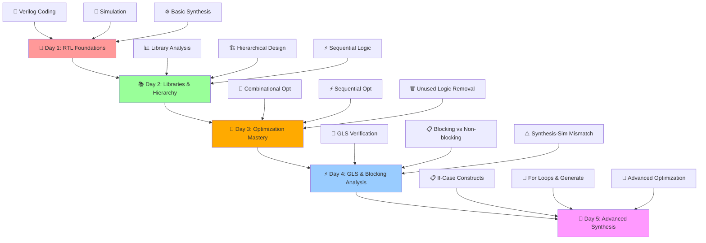

# 🚀 Advanced Verilog RTL Design & Synthesis Workshop
### *Complete Journey from RTL to Gate-Level Mastery*

[](https://en.wikipedia.org/wiki/Verilog)
[](http://iverilog.icarus.com/)
[](http://gtkwave.sourceforge.net/)
[](http://www.clifford.at/yosys/)
[](https://github.com/google/skywater-pdk)
[](#)

---

<div align="center">

*"From RTL concepts to ASIC implementation - A comprehensive journey through digital design synthesis"*

**🎯 Master the complete ASIC design flow with industry-standard tools and methodologies**

</div>

---

## 🌟 Workshop Overview

This comprehensive workshop covers the complete spectrum of RTL design and synthesis, from basic Verilog concepts to advanced optimization techniques. Dive deep into industry-standard tools and methodologies used in modern ASIC design flows.

### 🎯 **What You'll Master**
- **RTL Design Fundamentals** - Verilog coding and simulation
- **Synthesis Excellence** - Logic optimization and technology mapping
- **Timing Analysis** - Library characterization and PVT corners
- **Advanced Optimization** - Combinational and sequential techniques
- **Industry Tools** - iVerilog, GTKWave, Yosys, Sky130 PDK

---

## 🗓️ **Workshop Journey Map**

<div align="center">



</div>

---

## 📚 **Day-by-Day Learning Path**

### 🚀 **[Day 1: Introduction to Verilog RTL Design and Synthesis](./Day1/)**
*Foundation Building - From Code to Logic*

<div align="center">

[](#)
[](#)

</div>

**🎯 Learning Objectives:**
- **Introduction to Open-Source Simulator iVerilog**
- **Labs using iVerilog and GTKWave**
- **Introduction to Yosys and Logic Synthesis**
- **Labs using Yosys and Sky130 PDKs**

**🛠️ Tools & Technologies:**
- iVerilog for simulation
- GTKWave for waveform analysis
- Yosys for synthesis
- Sky130 PDK libraries

**🏆 Key Achievements:**
- ✅ Complete RTL simulation flow
- ✅ Basic synthesis understanding
- ✅ Tool setup and environment
- ✅ Sky130 library introduction

---

### 📚 **[Day 2: Timing Libraries, Hierarchical vs Flat Synthesis and Efficient Flop Coding Styles](./Day2/)**
*Advanced Concepts - Libraries, Hierarchy & Sequential Logic*

<div align="center">

[](#)
[](#)

</div>

**🎯 Learning Objectives:**
- **Introduction to Timing Libraries (.lib)**
- **Hierarchical vs Flat Synthesis**
- **Various Flop Coding Styles and Optimization**

**🔬 Deep Dive Topics:**
- PVT corner analysis and library characterization
- Synthesis strategy selection (Hierarchical vs Flat)
- Sequential logic design patterns
- Special case optimizations (mult_2, mult_8)

**🏆 Key Achievements:**
- ✅ Library analysis mastery
- ✅ Hierarchical design techniques
- ✅ Sequential logic optimization
- ✅ Advanced synthesis strategies

---

### 🔧 **[Day 3: Combinational and Sequential Optimizations](./Day3/)**
*Optimization Excellence - Logic Minimization & Resource Efficiency*

<div align="center">

[](#)
[](#)

</div>

**🎯 Learning Objectives:**
- **Introduction to Optimizations**
- **Combinational Logic Optimizations**
- **Sequential Logic Optimizations**
- **Sequential Optimizations for Unused Outputs**

**🔧 Optimization Techniques:**
- Constant propagation and Boolean minimization
- Sequential constant propagation
- State optimization and retiming
- Unused logic elimination

**🏆 Key Achievements:**
- ✅ Combinational optimization mastery
- ✅ Sequential optimization techniques
- ✅ Resource efficiency analysis
- ✅ Advanced synthesis commands

---

### ⚡ **[Day 4: GLS, Blocking vs Non-blocking and Synthesis-Simulation Mismatch](./Day4/)**
*Verification Excellence - GLS & Design Validation*

<div align="center">

[](#)
[](#)

</div>

**🎯 Learning Objectives:**
- **GLS, Synthesis-Simulation Mismatch and Blocking/Non-blocking Statements**
- **Labs on GLS and Synthesis-Simulation Mismatch**
- **Labs on Synth-Sim Mismatch for Blocking Statement**

**🔍 Critical Concepts:**
- Gate-level simulation methodology
- Synthesis-simulation mismatch detection
- Blocking vs non-blocking statement implications
- Design verification strategies

**🏆 Key Achievements:**
- ✅ GLS flow mastery
- ✅ Mismatch debugging techniques
- ✅ Blocking statement analysis
- ✅ Verification methodology

---

### 🎯 **[Day 5: Optimization in Synthesis](./Day5/)**
*Advanced Synthesis - Control Structures & Generate Statements*

<div align="center">

[](#)
[](#)

</div>

**🎯 Learning Objectives:**
- **If Case Constructs**
- **Labs on "Incomplete If Case"**
- **Labs on "Incomplete Overlapping Case"**
- **For Loop and For Generate**

**🎨 Advanced Constructs:**
- Conditional synthesis optimization
- Case statement synthesis implications
- Generate statement applications
- Loop unrolling and hardware generation

**🏆 Key Achievements:**
- ✅ Control structure synthesis
- ✅ Generate statement mastery
- ✅ Advanced optimization techniques
- ✅ Complex RTL synthesis

---

## 🛠️ **Workshop Toolkit**

### **🔧 Essential Tools**
| Tool | Purpose | Version | Documentation |
|------|---------|---------|---------------|
| **iVerilog** | Verilog Simulation | Latest | [📖 Docs](http://iverilog.icarus.com/) |
| **GTKWave** | Waveform Viewer | Latest | [📖 Docs](http://gtkwave.sourceforge.net/) |
| **Yosys** | Logic Synthesis | 0.9+ | [📖 Docs](http://www.clifford.at/yosys/) |
| **Sky130 PDK** | Process Design Kit | Latest | [📖 Docs](https://github.com/google/skywater-pdk) |

### **📚 Key Libraries**
- **sky130_fd_sc_hd** - High Density Standard Cells
- **sky130_fd_sc_hdll** - High Density Low Leakage
- **sky130_fd_sc_hs** - High Speed Standard Cells
- **sky130_fd_sc_ls** - Low Speed Standard Cells

---

## 🎯 **Learning Outcomes**

By completing this workshop, you will have mastered:

### **🧠 Technical Expertise**
- **RTL Design Proficiency** - Advanced Verilog coding techniques
- **Synthesis Mastery** - Logic optimization and technology mapping
- **Verification Skills** - Simulation and gate-level verification
- **Tool Proficiency** - Industry-standard EDA tool usage
- **Library Knowledge** - Standard cell characterization and selection

### **⚡ Professional Skills**
- **Design Methodology** - Complete ASIC design flow
- **Optimization Strategies** - Area, power, and timing optimization
- **Debug Techniques** - Synthesis-simulation mismatch resolution
- **Quality Assurance** - Design validation and verification
- **Industry Practices** - Real-world design considerations

---

## 🚀 **Getting Started**

### **📋 Prerequisites**
- Basic digital design knowledge
- Familiarity with Verilog syntax
- Linux environment (Ubuntu/CentOS recommended)
- Basic command-line proficiency

### **⚙️ Environment Setup**
```bash
# Clone the workshop repository
git clone <repository-url>
cd verilog-rtl-synthesis-workshop

# Install required tools (Ubuntu/Debian)
sudo apt-get update
sudo apt-get install iverilog gtkwave

# Install Yosys
git clone https://github.com/YosysHQ/yosys.git
cd yosys
make config-gcc
make -j$(nproc)
sudo make install
```

### **📚 Workshop Structure**
```
workshop/
├── Day1/           # RTL Foundations
├── Day2/           # Libraries & Hierarchy  
├── Day3/           # Optimization Mastery
├── Day4/           # GLS & Verification
├── Day5/           # Advanced Synthesis
├── lib/            # Standard Cell Libraries
├── verilog_files/  # RTL Source Files
└── README.md       # This file
```

---

## 📊 **Workshop Statistics**

### **📈 Coverage Metrics**
| Category | Labs Completed | Concepts Covered | Tools Mastered |
|----------|----------------|------------------|----------------|
| **RTL Design** | 15+ | 25+ | 4 |
| **Synthesis** | 20+ | 30+ | 3 |
| **Optimization** | 12+ | 20+ | 2 |
| **Verification** | 10+ | 15+ | 3 |
| **Advanced Topics** | 8+ | 12+ | 2 |

### **🎯 Skill Development**
- **Beginner → Intermediate**: Days 1-2
- **Intermediate → Advanced**: Days 3-4  
- **Advanced → Expert**: Day 5

---

## 🏆 **Workshop Achievements**

### **✅ Completion Badges**

<div align="center">

[](#)
[](#)
[](#)
[](#)
[](#)

</div>

### **🎖️ Certification Levels**
- **🥉 Bronze**: Complete Days 1-2 (Foundation Level)
- **🥈 Silver**: Complete Days 1-3 (Intermediate Level)
- **🥇 Gold**: Complete Days 1-4 (Advanced Level)
- **💎 Platinum**: Complete All Days (Expert Level)

---

## 🤝 **Community & Support**

### **📞 Getting Help**
- **Issues**: Open GitHub issues for technical problems
- **Discussions**: Use GitHub discussions for questions
- **Documentation**: Each day has comprehensive README files
- **Examples**: Extensive code examples provided

### **🌟 Contributing**
Contributions are welcome! Please:
1. Fork the repository
2. Create a feature branch
3. Add your improvements
4. Submit a pull request

---

## 📝 **License & Acknowledgments**

### **📄 License**
This workshop is provided under the [MIT License](LICENSE).

### **🙏 Acknowledgments**
- **SkyWater Technology** - Sky130 PDK
- **YosysHQ** - Yosys synthesis tool
- **Icarus Verilog Team** - iVerilog simulator
- **GTKWave Team** - Waveform viewer
- **Open Source Community** - Tools and libraries

---

## 🚀 **Ready to Begin Your Journey?**

<div align="center">

### 🎯 **Choose Your Starting Point**

[](./Day1/)
[](./Day2/)
[](./Day3/)
[](./Day4/)
[](./Day5/)

### **🎖️ Complete Workshop Status**
[](#)

**🚀 From RTL Concepts to ASIC Implementation - Master the Complete Design Flow! 🚀**

</div>

---

<div align="center">

*Built with ❤️ for the digital design community*

**🌟 Star this repository if it helped you master RTL design and synthesis! 🌟**

</div>
