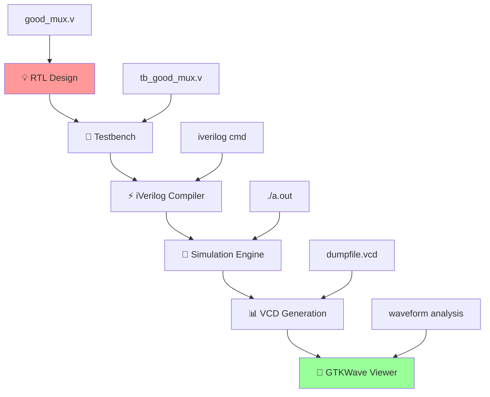
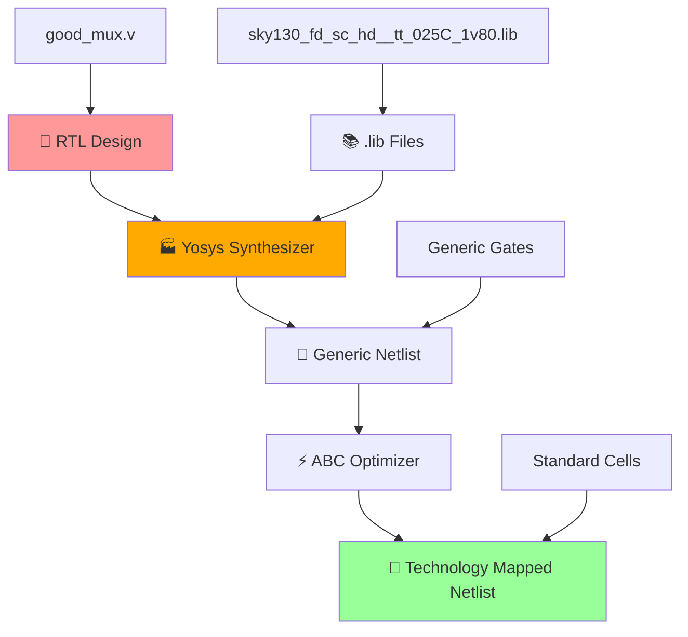

<div align="center">

# ⚡ Verilog RTL Design & Testbench Mastery
### *From Logic Dreams to Silicon Reality*

[](https://en.wikipedia.org/wiki/Verilog)
[](http://iverilog.icarus.com/)
[](http://gtkwave.sourceforge.net/)
[](#)
[](#)

---

*"Every great chip starts with perfect simulation"*

</div>

## 🌟 Mission Control Dashboard

> **Objective**: Master RTL design methodology and testbench architecture  
> **Timeline**: Day 1 - Foundation Building  
> **Focus**: Simulation-driven verification  

### 🎯 **Mission Stats**
| Component | Target |
|-----------|---------|
| 🔧 **Designs** | 2:1 Multiplexer |
| 🧪 **Testbenches** | Stimulus & Response |
| 📊 **Waveforms** | GTKWave Analysis |
| ⚡ **Flow** | Complete Sim Pipeline |

---

## 🔄 **The Simulation Command Center**

### 🚀 **Design Flow Architecture**
*The sacred path from RTL to waveforms*

<div align="center">



</div>

---

## 🏗️ **RTL Design Arsenal**

### 📁 **Project Structure Matrix**
*Your digital design headquarters*

```
sky130RTLDesignAndSynthesisWorkshop/
├── 🎯 verilog_files/           # Design & TB Collection
│   ├── ⭐ good_mux.v           # Perfect 2:1 Mux
│   ├── 🧪 tb_good_mux.v        # Master Testbench
│   ├── ⚠️ bad_mux.v            # Anti-pattern Example
│   ├── 🔄 bad_case.v           # Case Study Designs
│   └── 📦 [more designs...]    # Extended Library
├── 📚 my_lib/                  # Standard Library
│   ├── 📖 lib/                 # Liberty Files
│   └── 🔧 verilog_model/       # Cell Models
└── 📋 README.md                # Mission Briefing
```

---

## 🧪 **Laboratory Missions**

### **🚀 Mission 1: Command Center Setup**
*Preparing the digital battlefield*

#### **Phase 1: Navigation Protocol**
```bash
# 🎯 Enter the design matrix
cd sky130RTLDesignAndSynthesisWorkshop/verilog_files
ls -la
```

#### **Phase 2: Intelligence Gathering**
<details>
<summary>🔍 Click to expand reconnaissance commands</summary>

```bash
# 📖 Decode the perfect multiplexer
cat good_mux.v

# 🧪 Analyze the testbench architecture
cat tb_good_mux.v

# 🕵️ Compare with anti-patterns
cat bad_mux.v
```
</details>

### **⚡ Mission 2: The Perfect Multiplexer Campaign**
*Achieving simulation excellence*

#### **🔨 Compilation Protocol**
```bash
# 🎯 Forge the simulation executable
iverilog good_mux.v tb_good_mux.v -o mux_sim
```

#### **🚀 Launch Sequence**
```bash
# 🌊 Execute the digital symphony
./mux_sim
```

**Expected Victory Signals:**
- ✅ VCD file generation confirmation
- ✅ Clean simulation termination
- ✅ Zero compilation errors

#### **📊 Waveform Intelligence Analysis**
```bash
# 🌊 Enter the waveform dimension
gtkwave tb_good_mux.vcd
```

### **🧬 Mission 3: Testbench DNA Decoding**
*Understanding the genetic code of verification*

<div align="center">

| Component | Function | Power Level |
|-----------|----------|-------------|
| 🧠 **Module Declaration** | TB framework | Foundation |
| 🎛️ **Signal Declarations** | I/O interface | Connection |
| 🔌 **DUT Instantiation** | Design integration | Critical |
| ⚡ **Stimulus Engine** | Input generation | Active |
| 👁️ **Response Monitor** | Output verification | Vigilant |
| ⏰ **Simulation Control** | Time management | Essential |

</div>

#### **🎯 Code Examples from Lab**

**📋 Testbench Structure (tb_good_mux.v):**
```verilog
`timescale 1ns / 1ps
module tb_good_mux;
    // Inputs
    reg i0,i1,sel;
    // Outputs
    wire y;

    // Instantiate the Unit Under Test (UUT)
    good_mux uut (
        .sel(sel),
        .i0(i0),
        .i1(i1),
        .y(y)
    );

    initial begin
        $dumpfile("tb_good_mux.vcd");
        $dumpvars(0,tb_good_mux);
        // Initialize Inputs
        sel = 0;
        i0 = 0;
        i1 = 0;
        #300 $finish;
    end
endmodule
```

**🔧 Design Module (good_mux.v):**
```verilog
module good_mux (input i0, input i1, input sel, output reg y);
    always @(*)
    begin
        if(sel)
            y <= i1;
        else
            y <= i0;
    end
endmodule
```

### **🔬 Mission 4: Design Quality Assessment**
*Separating heroes from villains*

#### **⚔️ Battle Analysis Protocol**
```bash
# 🥊 Simulate the challenger
iverilog bad_mux.v tb_bad_mux.v -o bad_mux_sim
./bad_mux_sim
gtkwave tb_bad_mux.vcd
```

#### **🎯 Strategic Intelligence Questions**
1. **🔍 Quality Metrics**: What distinguishes elite from amateur designs?
2. **⏱️ Timing Analysis**: How do you spot timing violations?
3. **🏭 Synthesis Impact**: What are the manufacturing implications?

---

## 🧠 **Knowledge Arsenal Unlocked**

### **🎯 RTL Design Philosophy**
<div align="center">

| Methodology | Description | Impact Level |
|-------------|-------------|--------------|
| 🎭 **Behavioral** | High-level functionality | Strategic |
| 🏗️ **Structural** | Component interconnection | Tactical |
| 🎯 **Synthesis** | Hardware realization | Critical |
| 🧪 **Testability** | Verification readiness | Essential |

</div>

### **🧪 Testbench Mastery Protocols**
- **🎯 Complete Coverage**: Every input combination conquered
- **🌊 Edge Cases**: Boundary condition mastery
- **🤖 Self-Checking**: Autonomous verification systems
- **⏰ Timing Control**: Precise simulation orchestration

---

## 🛠️ **Mission Debug Protocols**

<div align="center">

| ⚠️ **Threat** | 🚨 **Detection** | 💡 **Countermeasure** |
|---------------|------------------|----------------------|
| Compilation Failure | `iverilog` error | Syntax audit & path verification |
| Waveform Void | Empty GTKWave | Deploy `$dumpfile` & `$dumpvars` |
| Simulation Lock | Infinite loop | Implement `$finish` protocol |
| Logic Malfunction | Wrong outputs | Review stimulus timing matrix |

</div>

---

## 📊 **Mission Report Template**

### **🎯 Simulation Intelligence**
**Target Analysis:** `good_mux.v`  
**Verification Status:** `✅ MISSION ACCOMPLISHED`  
**Key Discoveries:**
- 🔄 I/O relationship mapping confirmed
- ⏱️ Timing behavior within specifications  
- 🚨 Zero anomalies detected

### **📸 Waveform Evidence**
*GTKWave screenshots with tactical annotations*

### **🧬 Code Intelligence Report**
- 🏗️ Design architecture assessment
- 🧪 Testbench methodology evaluation
- 🏭 Synthesis readiness confirmation

---

## 🏆 **Victory Conditions Checklist**

### **✅ Mission Objectives Completed**
- [x] 🏗️ Environment warfare-ready
- [x] ⚡ good_mux simulation conquered
- [x] 🌊 GTKWave waveform intelligence gathered
- [x] 🧪 Testbench architecture decoded
- [x] 🥊 Bad design comparison executed
- [x] 📋 Mission documentation complete

### **🎁 Battle Trophies Collected**
- ✅ `mux_sim` (simulation weapon)
- ✅ `tb_good_mux.vcd` (waveform intelligence)
- ✅ GTKWave tactical save file
- ✅ Mission debrief documentation

---

<div align="center">

---

<div align="center">

### 🎖️ **Mission Status: CONQUERED**
*"Perfect simulation is the foundation of silicon success"*

[](#)
[](#synthesis-warfare)

</div>

---

## 🔥 **SYNTHESIS WARFARE** 
### *From RTL Dreams to Silicon Reality*

<div align="center">

[](https://github.com/YosysHQ/yosys)
[](#)
[](#)
[](#)

*"Synthesis is where RTL meets reality"*

</div>

### 🎯 **Synthesis Mission Stats**
| Component | Objective | Power Level |
|-----------|-----------|-------------|
| 🏭 **RTL to Gates** | Behavioral → Structural | Critical |
| 📚 **Liberty Files** | Cell Characterization | Essential |
| ⚡ **Optimization** | Area/Power/Timing Balance | Strategic |
| 🧪 **Verification** | Functional Equivalence | Mandatory |

---

## 🏗️ **The Synthesis Command Center**

### **🚀 Yosys Synthesis Architecture**
*The forge where RTL becomes silicon*

<div align="center">



</div>

### **📊 Synthesis Flow Phases**

#### **Phase 1: RTL Analysis & Elaboration** 🔍
- Parse RTL code and build internal representation
- Check for syntax and basic semantic errors
- Create hierarchical design database

#### **Phase 2: Generic Synthesis** ⚙️  
- Convert behavioral code to generic logic gates
- Perform technology-independent optimizations
- Generate unoptimized gate-level representation

#### **Phase 3: Technology Mapping** 🎯
- Map generic gates to target library cells  
- Consider area, power, and timing constraints
- Select optimal cell variants (fast/medium/slow)

#### **Phase 4: Optimization** ⚡
- Apply timing-driven optimizations
- Balance area vs. performance trade-offs
- Eliminate redundant logic

---

## 🧠 **Standard Cell Library Intelligence**

### **📚 Understanding .lib Files**
*The DNA of digital implementation*

<div align="center">

| Cell Type | Variants | Trade-off Matrix |
|-----------|----------|------------------|
| **🔧 Basic Logic** | AND, OR, NOT, NAND, NOR | Function vs Complexity |
| **🏃 Speed Variants** | Slow, Medium, Fast | Power vs Performance |  
| **💪 Drive Strength** | 1x, 2x, 4x, 8x | Area vs Drive Capability |
| **🎯 Special Cells** | Mux, XOR, Buffer, Inverter | Specialized Functions |

</div>

#### **🎯 The Critical Trade-offs**
```
⚡ FASTER CELLS:
  ✅ Reduced propagation delay
  ✅ Better timing closure  
  ❌ Increased area consumption
  ❌ Higher power consumption
  ❌ Potential hold time violations

🐌 SLOWER CELLS:  
  ✅ Lower power consumption
  ✅ Smaller area footprint
  ✅ Better hold time margins
  ❌ Increased propagation delay
  ❌ Timing closure challenges
```

### **⚖️ The Synthesis Balancing Act**

**🎭 Timing Constraint Equation:**
```
T_CLK > T_CQ_A + T_COMBI + T_SETUP_B + T_SKEW
```

Where:
- `T_CLK`: Clock period requirement
- `T_CQ_A`: D-FF output delay  
- `T_COMBI`: Combinational logic delay
- `T_SETUP_B`: Next D-FF setup time
- `T_SKEW`: Clock skew uncertainty

---

## 🛠️ **Synthesis Laboratory Missions**

### **🚀 Mission 1: Yosys Command Center Setup**

#### **Phase 1: Tool Configuration**
```bash
# 🎯 Enter synthesis mode
yosys
```

#### **Phase 2: Design Loading Protocol** 
```tcl
# 📖 Read RTL source
yosys> read_verilog good_mux.v

# 🧠 Analyze and elaborate  
yosys> synth -top good_mux

# 📚 Load target library
yosys> read_liberty -lib ../lib/sky130_fd_sc_hd__tt_025C_1v80.lib
```

#### **Phase 3: Technology Mapping Campaign**
```tcl
# 🎯 Map to standard cells
yosys> abc -liberty ../lib/sky130_fd_sc_hd__tt_025C_1v80.lib

# 📊 Generate synthesis statistics
yosys> stat

# 💾 Export netlist
yosys> write_verilog good_mux_netlist.v
yosys> show
```

### **🔬 Mission 2: Netlist Intelligence Analysis**

#### **🎯 Pre-Synthesis vs Post-Synthesis Comparison**

**RTL Code (Behavioral):**
```verilog
module good_mux (input i0, input i1, input sel, output reg y);
    always @(*) begin
        if(sel)
            y <= i1;
        else 
            y <= i0;
    end
endmodule
```

**Generated Netlist (Structural):**
```verilog
module good_mux(i0, i1, sel, y);
    wire _0_;
    wire _1_;
    wire _2_;
    input i0;
    input i1;
    input sel;
    output y;
    
    sky130_fd_sc_hd__mux2_1 _3_ (
        .A0(i0),
        .A1(i1), 
        .S(sel),
        .X(y)
    );
endmodule
```

**🔍 Actual Yosys Generated Netlist:**

*Complete netlist showing Yosys synthesis output with sky130 standard cells*

**📊 Synthesized Schematic View:**

*Visual representation of the synthesized multiplexer using sky130_fd_sc_hd__mux2_1 standard cell*

### **🧪 Mission 3: Verification Protocol**
*Ensuring functional equivalence*

#### **🔍 Gate-Level Simulation Setup**
```bash
# 🧪 Simulate synthesized netlist
iverilog -DFUNCTIONAL -DUNIT_DELAY=#1 \
         ../verilog_model/primitives.v \
         ../verilog_model/sky130_fd_sc_hd.v \
         good_mux_netlist.v tb_good_mux.v \
         -o netlist_sim

# 🚀 Execute simulation  
./netlist_sim

# 📊 Compare waveforms
gtkwave tb_good_mux.vcd
```

#### **✅ Verification Checklist**
- [ ] 🎯 Same functionality as RTL
- [ ] ⏱️ Timing behavior preserved  
- [ ] 🔌 I/O mapping correct
- [ ] 🚨 No synthesis warnings
- [ ] 📊 Resource utilization acceptable

---

## 🎯 **Advanced Synthesis Concepts**

### **🏁 Constraints-Driven Synthesis**

#### **⏰ Timing Constraints**
```tcl
# 🎯 Set clock constraints
create_clock -name clk -period 10 [get_ports clk]

# ⚡ Set input/output delays
set_input_delay -clock clk -max 2 [all_inputs]
set_output_delay -clock clk -max 2 [all_outputs]

# 🎯 Drive strength specification
set_driving_cell -lib_cell sky130_fd_sc_hd__buf_1 [all_inputs]
```

#### **💪 Area and Power Optimization**
```tcl
# 🎯 Area optimization priority
set_max_area 1000

# ⚡ Power optimization
set_max_dynamic_power 50

# 🏃 Speed vs Area trade-off
compile_ultra -gate_clock
```

### **🔧 Multi-Level Optimization Strategy**

<div align="center">

| Level | Focus | Techniques |
|-------|-------|------------|
| **🏗️ Architectural** | Algorithm & Structure | RTL refactoring, Pipeline |
| **🎯 Logic** | Boolean Optimization | K-maps, Factoring, Sharing |
| **🔧 Gate** | Cell Selection | Drive strength, Vt selection |
| **📐 Physical** | Layout Optimization | Placement, Routing aware |

</div>

---

## 📊 **Synthesis Quality Metrics**

### **🎯 Key Performance Indicators**

#### **⏱️ Timing Analysis**
```bash
# Critical path analysis
report_timing -max_paths 10

# Setup/Hold analysis  
report_constraint -all_violators

# Clock analysis
report_clock -skew
```

#### **📊 Area Report**
```bash
# Cell area breakdown
report_area -hierarchy

# Resource utilization
report_resources

# Gate count analysis
report_cell -nosplit
```

#### **⚡ Power Analysis** 
```bash
# Dynamic power estimation
report_power -analysis_effort medium

# Leakage power breakdown
report_power -leakage

# Clock power analysis
report_power -clock_network
```

---

## 🛡️ **Synthesis Debug Protocols**

<div align="center">

| ⚠️ **Threat** | 🚨 **Symptoms** | 💡 **Countermeasures** |
|---------------|-----------------|----------------------|
| **Timing Violations** | Negative slack | Faster cells, pipeline, reduce logic depth |
| **Area Explosion** | Excessive cell count | Logic sharing, hierarchy optimization |
| **Power Issues** | High dynamic power | Clock gating, voltage scaling, low-Vt cells |
| **Functional Mismatch** | Simulation differences | Proper modeling, X-handling, reset analysis |

</div>

### **🔧 Common Synthesis Issues & Solutions**

#### **Issue 1: Inferring Latches** ⚠️
```verilog
// ❌ Problem: Incomplete case statement
always @(*) begin
    case(sel)
        2'b00: y = a;
        2'b01: y = b;
        // Missing cases infer latches!
    endcase
end

// ✅ Solution: Complete case with default
always @(*) begin
    case(sel)
        2'b00: y = a;
        2'b01: y = b;
        default: y = 1'b0; // or 1'bx
    endcase
end
```

#### **Issue 2: Combinational Loops** 🔄
```verilog
// ❌ Problem: Combinational feedback
assign y = sel ? a : y;

// ✅ Solution: Break the loop  
always @(posedge clk) begin
    y <= sel ? a : y;
end
```

---

## 🏆 **Victory Conditions**

### **✅ Synthesis Mastery Checklist**
- [ ] 🏭 Yosys synthesis flow mastered
- [ ] 📚 .lib file understanding achieved  
- [ ] ⚡ Technology mapping completed
- [ ] 🧪 Gate-level verification passed
- [ ] 📊 Synthesis reports analyzed
- [ ] 🔧 Debug techniques practiced
- [ ] 🎯 Constraint methodology learned

### **🎁 Advanced Trophies Unlocked**
- Gate-level netlist generation
- Standard cell library mastery  
- Synthesis constraint application
- Multi-objective optimization
- Functional equivalence verification

---

<div align="center">

### 🎖️ **Mission Status: SYNTHESIS MASTERY ACHIEVED**
*"From RTL dreams to gate-level reality - the synthesis journey complete!"*

[](#)
[](#)

---

## 📡 **Support Command**
🆘 **Emergency Protocols:**
1. 📊 Analyze synthesis logs
2. 🔐 Verify library paths
3. 🧬 Review constraint files  
4. 📖 Consult synthesis guides
5. 🎯 Check netlist functionality

**🎯 Remember: Perfect synthesis is the bridge between dreams and silicon! ⚡**

</div>

</div>
