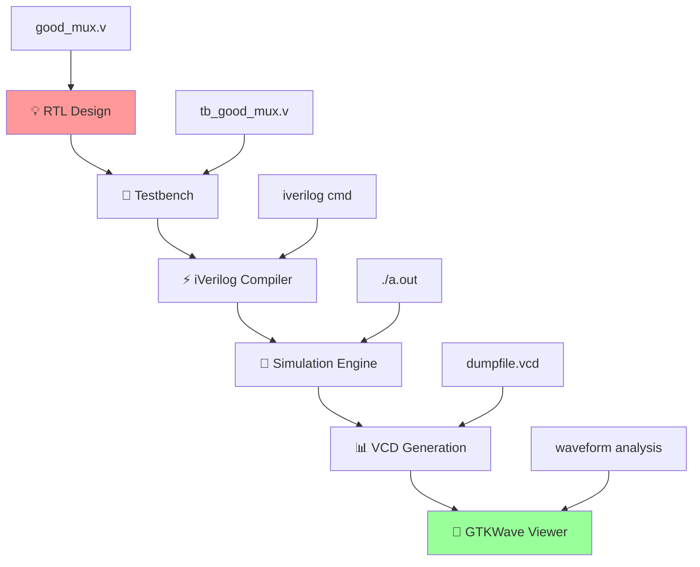

<div align="center">

# ⚡ Verilog RTL Design & Testbench Mastery
### *From Logic Dreams to Silicon Reality*

[](https://en.wikipedia.org/wiki/Verilog)
[](http://iverilog.icarus.com/)
[](http://gtkwave.sourceforge.net/)
[](#)
[](#)

---

*"Every great chip starts with perfect simulation"*

</div>

## 🌟 Mission Control Dashboard

> **Objective**: Master RTL design methodology and testbench architecture  
> **Timeline**: Day 1 - Foundation Building  
> **Focus**: Simulation-driven verification  

### 🎯 **Mission Stats**
| Component | Target |
|-----------|---------|
| 🔧 **Designs** | 2:1 Multiplexer |
| 🧪 **Testbenches** | Stimulus & Response |
| 📊 **Waveforms** | GTKWave Analysis |
| ⚡ **Flow** | Complete Sim Pipeline |

---

## 🔄 **The Simulation Command Center**

### 🚀 **Design Flow Architecture**
*The sacred path from RTL to waveforms*

<div align="center">



</div>

---

## 🏗️ **RTL Design Arsenal**

### 📁 **Project Structure Matrix**
*Your digital design headquarters*

```
sky130RTLDesignAndSynthesisWorkshop/
├── 🎯 verilog_files/           # Design & TB Collection
│   ├── ⭐ good_mux.v           # Perfect 2:1 Mux
│   ├── 🧪 tb_good_mux.v        # Master Testbench
│   ├── ⚠️ bad_mux.v            # Anti-pattern Example
│   ├── 🔄 bad_case.v           # Case Study Designs
│   └── 📦 [more designs...]    # Extended Library
├── 📚 my_lib/                  # Standard Library
│   ├── 📖 lib/                 # Liberty Files
│   └── 🔧 verilog_model/       # Cell Models
└── 📋 README.md                # Mission Briefing
```

---

## 🧪 **Laboratory Missions**

### **🚀 Mission 1: Command Center Setup**
*Preparing the digital battlefield*

#### **Phase 1: Navigation Protocol**
```bash
# 🎯 Enter the design matrix
cd sky130RTLDesignAndSynthesisWorkshop/verilog_files
ls -la
```

#### **Phase 2: Intelligence Gathering**
<details>
<summary>🔍 Click to expand reconnaissance commands</summary>

```bash
# 📖 Decode the perfect multiplexer
cat good_mux.v

# 🧪 Analyze the testbench architecture
cat tb_good_mux.v

# 🕵️ Compare with anti-patterns
cat bad_mux.v
```
</details>

### **⚡ Mission 2: The Perfect Multiplexer Campaign**
*Achieving simulation excellence*

#### **🔨 Compilation Protocol**
```bash
# 🎯 Forge the simulation executable
iverilog good_mux.v tb_good_mux.v -o mux_sim
```

#### **🚀 Launch Sequence**
```bash
# 🌊 Execute the digital symphony
./mux_sim
```

**Expected Victory Signals:**
- ✅ VCD file generation confirmation
- ✅ Clean simulation termination
- ✅ Zero compilation errors

#### **📊 Waveform Intelligence Analysis**
```bash
# 🌊 Enter the waveform dimension
gtkwave tb_good_mux.vcd
```

### **🧬 Mission 3: Testbench DNA Decoding**
*Understanding the genetic code of verification*

<div align="center">

| Component | Function | Power Level |
|-----------|----------|-------------|
| 🧠 **Module Declaration** | TB framework | Foundation |
| 🎛️ **Signal Declarations** | I/O interface | Connection |
| 🔌 **DUT Instantiation** | Design integration | Critical |
| ⚡ **Stimulus Engine** | Input generation | Active |
| 👁️ **Response Monitor** | Output verification | Vigilant |
| ⏰ **Simulation Control** | Time management | Essential |

</div>

#### **🎯 Testbench Architecture Mastery**

**Clock Generation Engine:**
```verilog
initial begin
    clk = 0;
    forever #10 clk = ~clk;  // 🔄 20ns period heartbeat
end
```

**Stimulus Command Center:**
```verilog
initial begin
    // 🎬 Initialize the battlefield
    sel = 0; i0 = 0; i1 = 0;
    
    // ⚡ Deploy test vectors
    #100 sel = 0; i0 = 1; i1 = 0;  // Test case Alpha
    #100 sel = 1; i0 = 1; i1 = 0;  // Test case Beta
    // 🎯 Strategic test patterns...
end
```

**Response Surveillance System:**
```verilog
initial begin
    $monitor("🕐 Time=%0t 🎛️ sel=%b i0=%b i1=%b ➡️ y=%b", 
             $time, sel, i0, i1, y);
end
```

### **🔬 Mission 4: Design Quality Assessment**
*Separating heroes from villains*

#### **⚔️ Battle Analysis Protocol**
```bash
# 🥊 Simulate the challenger
iverilog bad_mux.v tb_bad_mux.v -o bad_mux_sim
./bad_mux_sim
gtkwave tb_bad_mux.vcd
```

#### **🎯 Strategic Intelligence Questions**
1. **🔍 Quality Metrics**: What distinguishes elite from amateur designs?
2. **⏱️ Timing Analysis**: How do you spot timing violations?
3. **🏭 Synthesis Impact**: What are the manufacturing implications?

---

## 🧠 **Knowledge Arsenal Unlocked**

### **🎯 RTL Design Philosophy**
<div align="center">

| Methodology | Description | Impact Level |
|-------------|-------------|--------------|
| 🎭 **Behavioral** | High-level functionality | Strategic |
| 🏗️ **Structural** | Component interconnection | Tactical |
| 🎯 **Synthesis** | Hardware realization | Critical |
| 🧪 **Testability** | Verification readiness | Essential |

</div>

### **🧪 Testbench Mastery Protocols**
- **🎯 Complete Coverage**: Every input combination conquered
- **🌊 Edge Cases**: Boundary condition mastery
- **🤖 Self-Checking**: Autonomous verification systems
- **⏰ Timing Control**: Precise simulation orchestration

---

## 🛠️ **Mission Debug Protocols**

<div align="center">

| ⚠️ **Threat** | 🚨 **Detection** | 💡 **Countermeasure** |
|---------------|------------------|----------------------|
| Compilation Failure | `iverilog` error | Syntax audit & path verification |
| Waveform Void | Empty GTKWave | Deploy `$dumpfile` & `$dumpvars` |
| Simulation Lock | Infinite loop | Implement `$finish` protocol |
| Logic Malfunction | Wrong outputs | Review stimulus timing matrix |

</div>

---

## 📊 **Mission Report Template**

### **🎯 Simulation Intelligence**
**Target Analysis:** `good_mux.v`  
**Verification Status:** `✅ MISSION ACCOMPLISHED`  
**Key Discoveries:**
- 🔄 I/O relationship mapping confirmed
- ⏱️ Timing behavior within specifications  
- 🚨 Zero anomalies detected

### **📸 Waveform Evidence**
*GTKWave screenshots with tactical annotations*

### **🧬 Code Intelligence Report**
- 🏗️ Design architecture assessment
- 🧪 Testbench methodology evaluation
- 🏭 Synthesis readiness confirmation

---

## 🏆 **Victory Conditions Checklist**

### **✅ Mission Objectives Completed**
- [ ] 🏗️ Environment warfare-ready
- [ ] ⚡ good_mux simulation conquered
- [ ] 🌊 GTKWave waveform intelligence gathered
- [ ] 🧪 Testbench architecture decoded
- [ ] 🥊 Bad design comparison executed
- [ ] 📋 Mission documentation complete

### **🎁 Battle Trophies Collected**
- `mux_sim` (simulation weapon)
- `tb_good_mux.vcd` (waveform intelligence)
- GTKWave tactical save file
- Mission debrief documentation

---

## 🚀 **Next Mission Prep: Day 2**
*Advancing to synthesis command*

- 🔬 Review synthesis methodologies  
- 📚 Study library file architectures  
- 🏗️ Prepare for hierarchical battles  
- 🎯 Master standard cell libraries  

---

<div align="center">

### 🎖️ **Mission Status: DAY 1 CONQUERED**
*"Perfect simulation is the foundation of silicon success"*

[](#)

---

## 📡 **Support Command**
🆘 **Emergency Protocols:**
1. 📊 Analyze simulation logs
2. 🔐 Verify file permissions  
3. 🧬 Review Verilog syntax
4. 📖 Consult tool manuals

**🎯 Remember: Great designs are built on perfect simulations! ⚡**

</div>
